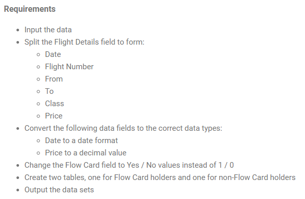

<a id="Prep_Air's_Flow_Card"></a>
### Prep_Air's_Flow_Card
At Preppin' Data we use a number of (mock) companies to look at the challenges they have with their data. For January, we're going to focus on our own airline, Prep Air. The airline has introduced a new loyalty card called the Flow Card. We need to clean up a number of data sets to determine how well the card is doing. 

The first task is setting some context for later weeks by understanding how popular the Flow Card is. Our stakeholder would like two data sets about our passengers. One data set for card users and one data set for those who don't use the card. 



```python
import pandas as pd
```


```python
df = pd.read_csv('PD 2024 Wk 1 Input.csv')
df.head()
```


<div>
<style scoped>
    .dataframe tbody tr th:only-of-type {
        vertical-align: middle;
    }

    .dataframe tbody tr th {
        vertical-align: top;
    }

    .dataframe thead th {
        text-align: right;
    }
</style>
<table border="1" class="dataframe">
  <thead>
    <tr style="text-align: right;">
      <th></th>
      <th>Flight Details</th>
      <th>Flow Card?</th>
      <th>Bags Checked</th>
      <th>Meal Type</th>
    </tr>
  </thead>
  <tbody>
    <tr>
      <th>0</th>
      <td>2024-07-22//PA010//Tokyo-New York//Economy//2380</td>
      <td>1</td>
      <td>0</td>
      <td>Egg Free</td>
    </tr>
    <tr>
      <th>1</th>
      <td>2024-09-28//PA008//Perth-New York//Economy//1855</td>
      <td>0</td>
      <td>2</td>
      <td>Vegetarian</td>
    </tr>
    <tr>
      <th>2</th>
      <td>2024-04-20//PA002//New York-London//Economy//3490</td>
      <td>1</td>
      <td>1</td>
      <td>Vegan</td>
    </tr>
    <tr>
      <th>3</th>
      <td>2024-01-23//PA010//Tokyo-New York//Premium Eco...</td>
      <td>1</td>
      <td>1</td>
      <td>Vegetarian</td>
    </tr>
    <tr>
      <th>4</th>
      <td>2024-10-01//PA008//Perth-New York//Business Cl...</td>
      <td>0</td>
      <td>0</td>
      <td>Vegetarian</td>
    </tr>
  </tbody>
</table>
</div>


```python
df['Flight Details'][0]
```


    '2024-07-22//PA010//Tokyo-New York//Economy//2380'


### Split the Flight Details field Solution

To clean and prepare the data for analysis, the following steps will be executed:

1. **Define the Column Structure:**  
   A list of column names will be established to standardize the structure of the dataset. The column names include:  
   `['Date', 'Flight Number', 'From-To', 'Class', 'Price']`.

2. **Parse Flight Details:**  
   The raw flight details will be split using the delimiter `//`. This will transform the string into a list of values corresponding to each column in the predefined list.  

   Example:  
   - **Input String:** `"2024-07-22//PA010//Tokyo-New York//Economy//2380"`  
   - **Parsed Output:** `['2024-07-22', 'PA010', 'Tokyo-New York', 'Economy', '2380']`

3. **Extract Origin and Destination:**  
   The value from the `From-To` column (index 2) will be further split using the `-` delimiter. This will separate the flight's origin (`From`) and destination (`To`) into two distinct fields for enhanced clarity and analysis.  

   Example:  
   - **Input:** `"Tokyo-New York"`  
   - **Output:**  
     - `From: "Tokyo"`  
     - `To: "New York"`


```python
new_cols = ['Date', 'Flight Number', 'From-To', 'Class', 'Price']
for col_index, col in enumerate(new_cols):
    # if col = 'From-to'
    # we are going to split it to two columns
    if col_index == 2:
        df['From'] = df['Flight Details'].apply(lambda x: x.split('//')[col_index]).apply(lambda x:x.split('-')[0])
        df['To'] = df['Flight Details'].apply(lambda x: x.split('//')[col_index]).apply(lambda x:x.split('-')[1])
    else:
        df[col] = df['Flight Details'].apply(lambda x: x.split('//')[col_index])
        
```


```python
df.head()
```


<div>
<style scoped>
    .dataframe tbody tr th:only-of-type {
        vertical-align: middle;
    }

    .dataframe tbody tr th {
        vertical-align: top;
    }

    .dataframe thead th {
        text-align: right;
    }
</style>
<table border="1" class="dataframe">
  <thead>
    <tr style="text-align: right;">
      <th></th>
      <th>Flight Details</th>
      <th>Flow Card?</th>
      <th>Bags Checked</th>
      <th>Meal Type</th>
      <th>Date</th>
      <th>Flight Number</th>
      <th>From</th>
      <th>To</th>
      <th>Class</th>
      <th>Price</th>
    </tr>
  </thead>
  <tbody>
    <tr>
      <th>0</th>
      <td>2024-07-22//PA010//Tokyo-New York//Economy//2380</td>
      <td>1</td>
      <td>0</td>
      <td>Egg Free</td>
      <td>2024-07-22</td>
      <td>PA010</td>
      <td>Tokyo</td>
      <td>New York</td>
      <td>Economy</td>
      <td>2380</td>
    </tr>
    <tr>
      <th>1</th>
      <td>2024-09-28//PA008//Perth-New York//Economy//1855</td>
      <td>0</td>
      <td>2</td>
      <td>Vegetarian</td>
      <td>2024-09-28</td>
      <td>PA008</td>
      <td>Perth</td>
      <td>New York</td>
      <td>Economy</td>
      <td>1855</td>
    </tr>
    <tr>
      <th>2</th>
      <td>2024-04-20//PA002//New York-London//Economy//3490</td>
      <td>1</td>
      <td>1</td>
      <td>Vegan</td>
      <td>2024-04-20</td>
      <td>PA002</td>
      <td>New York</td>
      <td>London</td>
      <td>Economy</td>
      <td>3490</td>
    </tr>
    <tr>
      <th>3</th>
      <td>2024-01-23//PA010//Tokyo-New York//Premium Eco...</td>
      <td>1</td>
      <td>1</td>
      <td>Vegetarian</td>
      <td>2024-01-23</td>
      <td>PA010</td>
      <td>Tokyo</td>
      <td>New York</td>
      <td>Premium Economy</td>
      <td>825</td>
    </tr>
    <tr>
      <th>4</th>
      <td>2024-10-01//PA008//Perth-New York//Business Cl...</td>
      <td>0</td>
      <td>0</td>
      <td>Vegetarian</td>
      <td>2024-10-01</td>
      <td>PA008</td>
      <td>Perth</td>
      <td>New York</td>
      <td>Business Class</td>
      <td>634.79999999999995</td>
    </tr>
  </tbody>
</table>
</div>


```python
df = df[df.columns[4:].tolist() + df.columns[1:4].tolist()]
```


```python
df.info()
```

    <class 'pandas.core.frame.DataFrame'>
    RangeIndex: 3778 entries, 0 to 3777
    Data columns (total 9 columns):
     #   Column         Non-Null Count  Dtype 
    ---  ------         --------------  ----- 
     0   Date           3778 non-null   object
     1   Flight Number  3778 non-null   object
     2   From           3778 non-null   object
     3   To             3778 non-null   object
     4   Class          3778 non-null   object
     5   Price          3778 non-null   object
     6   Flow Card?     3778 non-null   int64 
     7   Bags Checked   3778 non-null   int64 
     8   Meal Type      3189 non-null   object
    dtypes: int64(2), object(7)
    memory usage: 265.8+ KB
    


```python
df['Date'] = pd.to_datetime(df['Date'])
df['Price'] = pd.to_numeric(df['Price'])
```


```python
df.info()
```

    <class 'pandas.core.frame.DataFrame'>
    RangeIndex: 3778 entries, 0 to 3777
    Data columns (total 9 columns):
     #   Column         Non-Null Count  Dtype         
    ---  ------         --------------  -----         
     0   Date           3778 non-null   datetime64[ns]
     1   Flight Number  3778 non-null   object        
     2   From           3778 non-null   object        
     3   To             3778 non-null   object        
     4   Class          3778 non-null   object        
     5   Price          3778 non-null   float64       
     6   Flow Card?     3778 non-null   int64         
     7   Bags Checked   3778 non-null   int64         
     8   Meal Type      3189 non-null   object        
    dtypes: datetime64[ns](1), float64(1), int64(2), object(5)
    memory usage: 265.8+ KB
    


```python
flow_card = {1: 'Yes', 0: 'No'}
df['Flow Card?'] = df['Flow Card?'].map(lambda x:flow_card.get(x, x))
```


```python
df['Flow Card?'].value_counts()
```


    Flow Card?
    No     1895
    Yes    1883
    Name: count, dtype: int64


```python
flow_card = df[df['Flow Card?'] == 'Yes']
no_flow_card = df[df['Flow Card?'] == 'No']
```


```python
flow_card.head()
```


<div>
<style scoped>
    .dataframe tbody tr th:only-of-type {
        vertical-align: middle;
    }

    .dataframe tbody tr th {
        vertical-align: top;
    }

    .dataframe thead th {
        text-align: right;
    }
</style>
<table border="1" class="dataframe">
  <thead>
    <tr style="text-align: right;">
      <th></th>
      <th>Date</th>
      <th>Flight Number</th>
      <th>From</th>
      <th>To</th>
      <th>Class</th>
      <th>Price</th>
      <th>Flow Card?</th>
      <th>Bags Checked</th>
      <th>Meal Type</th>
    </tr>
  </thead>
  <tbody>
    <tr>
      <th>0</th>
      <td>2024-07-22</td>
      <td>PA010</td>
      <td>Tokyo</td>
      <td>New York</td>
      <td>Economy</td>
      <td>2380.0</td>
      <td>Yes</td>
      <td>0</td>
      <td>Egg Free</td>
    </tr>
    <tr>
      <th>2</th>
      <td>2024-04-20</td>
      <td>PA002</td>
      <td>New York</td>
      <td>London</td>
      <td>Economy</td>
      <td>3490.0</td>
      <td>Yes</td>
      <td>1</td>
      <td>Vegan</td>
    </tr>
    <tr>
      <th>3</th>
      <td>2024-01-23</td>
      <td>PA010</td>
      <td>Tokyo</td>
      <td>New York</td>
      <td>Premium Economy</td>
      <td>825.0</td>
      <td>Yes</td>
      <td>1</td>
      <td>Vegetarian</td>
    </tr>
    <tr>
      <th>6</th>
      <td>2024-06-05</td>
      <td>PA006</td>
      <td>Tokyo</td>
      <td>London</td>
      <td>First Class</td>
      <td>618.0</td>
      <td>Yes</td>
      <td>3</td>
      <td>Vegan</td>
    </tr>
    <tr>
      <th>8</th>
      <td>2024-03-30</td>
      <td>PA004</td>
      <td>Perth</td>
      <td>London</td>
      <td>First Class</td>
      <td>446.0</td>
      <td>Yes</td>
      <td>1</td>
      <td>Nut Free</td>
    </tr>
  </tbody>
</table>
</div>


```python
no_flow_card.head()
```


<div>
<style scoped>
    .dataframe tbody tr th:only-of-type {
        vertical-align: middle;
    }

    .dataframe tbody tr th {
        vertical-align: top;
    }

    .dataframe thead th {
        text-align: right;
    }
</style>
<table border="1" class="dataframe">
  <thead>
    <tr style="text-align: right;">
      <th></th>
      <th>Date</th>
      <th>Flight Number</th>
      <th>From</th>
      <th>To</th>
      <th>Class</th>
      <th>Price</th>
      <th>Flow Card?</th>
      <th>Bags Checked</th>
      <th>Meal Type</th>
    </tr>
  </thead>
  <tbody>
    <tr>
      <th>1</th>
      <td>2024-09-28</td>
      <td>PA008</td>
      <td>Perth</td>
      <td>New York</td>
      <td>Economy</td>
      <td>1855.0</td>
      <td>No</td>
      <td>2</td>
      <td>Vegetarian</td>
    </tr>
    <tr>
      <th>4</th>
      <td>2024-10-01</td>
      <td>PA008</td>
      <td>Perth</td>
      <td>New York</td>
      <td>Business Class</td>
      <td>634.8</td>
      <td>No</td>
      <td>0</td>
      <td>Vegetarian</td>
    </tr>
    <tr>
      <th>5</th>
      <td>2024-03-04</td>
      <td>PA007</td>
      <td>New York</td>
      <td>Perth</td>
      <td>Business Class</td>
      <td>458.4</td>
      <td>No</td>
      <td>3</td>
      <td>Nut Free</td>
    </tr>
    <tr>
      <th>7</th>
      <td>2024-02-25</td>
      <td>PA010</td>
      <td>Tokyo</td>
      <td>New York</td>
      <td>Premium Economy</td>
      <td>1435.0</td>
      <td>No</td>
      <td>0</td>
      <td>NaN</td>
    </tr>
    <tr>
      <th>13</th>
      <td>2024-03-29</td>
      <td>PA004</td>
      <td>Perth</td>
      <td>London</td>
      <td>Economy</td>
      <td>2730.0</td>
      <td>No</td>
      <td>2</td>
      <td>Vegan</td>
    </tr>
  </tbody>
</table>
</div>


```python
flow_card.info()
```

    <class 'pandas.core.frame.DataFrame'>
    Index: 1883 entries, 0 to 3777
    Data columns (total 9 columns):
     #   Column         Non-Null Count  Dtype         
    ---  ------         --------------  -----         
     0   Date           1883 non-null   datetime64[ns]
     1   Flight Number  1883 non-null   object        
     2   From           1883 non-null   object        
     3   To             1883 non-null   object        
     4   Class          1883 non-null   object        
     5   Price          1883 non-null   float64       
     6   Flow Card?     1883 non-null   object        
     7   Bags Checked   1883 non-null   int64         
     8   Meal Type      1594 non-null   object        
    dtypes: datetime64[ns](1), float64(1), int64(1), object(6)
    memory usage: 147.1+ KB
    


```python
no_flow_card.info()
```

    <class 'pandas.core.frame.DataFrame'>
    Index: 1895 entries, 1 to 3776
    Data columns (total 9 columns):
     #   Column         Non-Null Count  Dtype         
    ---  ------         --------------  -----         
     0   Date           1895 non-null   datetime64[ns]
     1   Flight Number  1895 non-null   object        
     2   From           1895 non-null   object        
     3   To             1895 non-null   object        
     4   Class          1895 non-null   object        
     5   Price          1895 non-null   float64       
     6   Flow Card?     1895 non-null   object        
     7   Bags Checked   1895 non-null   int64         
     8   Meal Type      1595 non-null   object        
    dtypes: datetime64[ns](1), float64(1), int64(1), object(6)
    memory usage: 148.0+ KB
    
