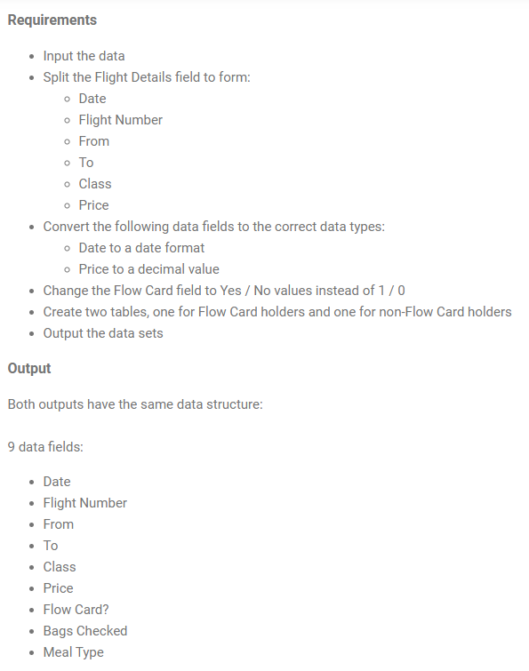

### Prep_Air's_Flow_Card
At Preppin' Data we use a number of (mock) companies to look at the challenges they have with their data. For January, we're going to focus on our own airline, Prep Air. The airline has introduced a new loyalty card called the Flow Card. We need to clean up a number of data sets to determine how well the card is doing. 

The first task is setting some context for later weeks by understanding how popular the Flow Card is. Our stakeholder would like two data sets about our passengers. One data set for card users and one data set for those who don't use the card. 

