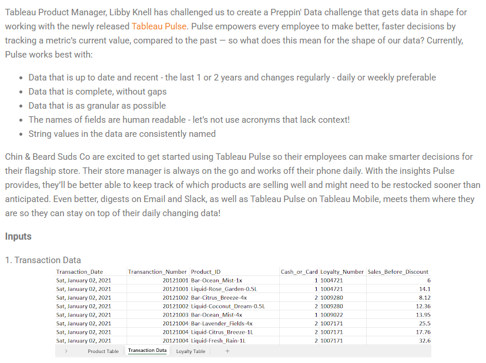
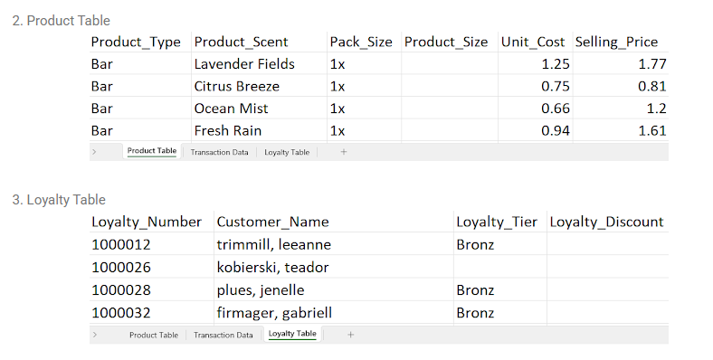
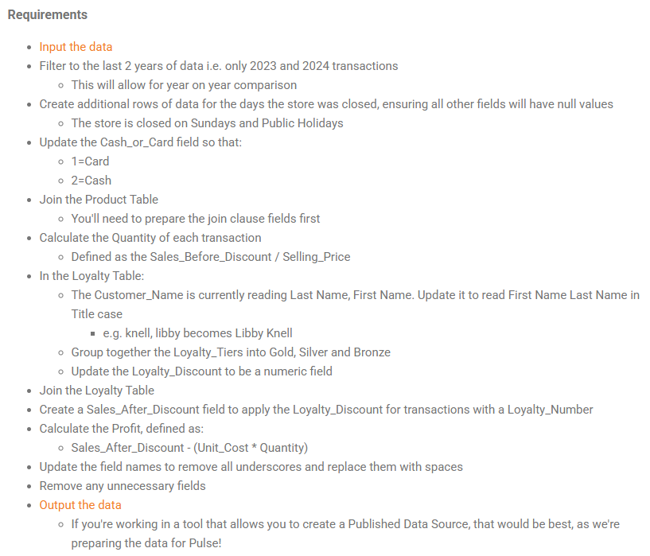

## 2024 Week 10 - Preppin' for Pulse





```python
import pandas as pd
```


```python
excel_sheets = pd.read_excel('2024W10 Input.xlsx', sheet_name=None)
```


```python
product = excel_sheets['Product Table']
transaction = excel_sheets['Transaction Data']
loyalty = excel_sheets['Loyalty Table']
```


```python
product.head()
```


<div>
<style scoped>
    .dataframe tbody tr th:only-of-type {
        vertical-align: middle;
    }

    .dataframe tbody tr th {
        vertical-align: top;
    }

    .dataframe thead th {
        text-align: right;
    }
</style>
<table border="1" class="dataframe">
  <thead>
    <tr style="text-align: right;">
      <th></th>
      <th>Product_Type</th>
      <th>Product_Scent</th>
      <th>Pack_Size</th>
      <th>Product_Size</th>
      <th>Unit_Cost</th>
      <th>Selling_Price</th>
    </tr>
  </thead>
  <tbody>
    <tr>
      <th>0</th>
      <td>Bar</td>
      <td>Lavender Fields</td>
      <td>1x</td>
      <td>NaN</td>
      <td>1.25</td>
      <td>1.77</td>
    </tr>
    <tr>
      <th>1</th>
      <td>Bar</td>
      <td>Citrus Breeze</td>
      <td>1x</td>
      <td>NaN</td>
      <td>0.75</td>
      <td>0.81</td>
    </tr>
    <tr>
      <th>2</th>
      <td>Bar</td>
      <td>Ocean Mist</td>
      <td>1x</td>
      <td>NaN</td>
      <td>0.66</td>
      <td>1.20</td>
    </tr>
    <tr>
      <th>3</th>
      <td>Bar</td>
      <td>Fresh Rain</td>
      <td>1x</td>
      <td>NaN</td>
      <td>0.94</td>
      <td>1.61</td>
    </tr>
    <tr>
      <th>4</th>
      <td>Bar</td>
      <td>Rose Garden</td>
      <td>1x</td>
      <td>NaN</td>
      <td>1.55</td>
      <td>2.45</td>
    </tr>
  </tbody>
</table>
</div>


```python
transaction.head()
```


<div>
<style scoped>
    .dataframe tbody tr th:only-of-type {
        vertical-align: middle;
    }

    .dataframe tbody tr th {
        vertical-align: top;
    }

    .dataframe thead th {
        text-align: right;
    }
</style>
<table border="1" class="dataframe">
  <thead>
    <tr style="text-align: right;">
      <th></th>
      <th>Transaction_Date</th>
      <th>Transanction_Number</th>
      <th>Product_ID</th>
      <th>Cash_or_Card</th>
      <th>Loyalty_Number</th>
      <th>Sales_Before_Discount</th>
    </tr>
  </thead>
  <tbody>
    <tr>
      <th>0</th>
      <td>Sat, January 02, 2021</td>
      <td>20121001</td>
      <td>Bar-Ocean_Mist-1x</td>
      <td>1</td>
      <td>1004721.0</td>
      <td>6.00</td>
    </tr>
    <tr>
      <th>1</th>
      <td>Sat, January 02, 2021</td>
      <td>20121001</td>
      <td>Liquid-Rose_Garden-0.5L</td>
      <td>1</td>
      <td>1004721.0</td>
      <td>14.10</td>
    </tr>
    <tr>
      <th>2</th>
      <td>Sat, January 02, 2021</td>
      <td>20121002</td>
      <td>Bar-Citrus_Breeze-4x</td>
      <td>2</td>
      <td>1009280.0</td>
      <td>8.12</td>
    </tr>
    <tr>
      <th>3</th>
      <td>Sat, January 02, 2021</td>
      <td>20121002</td>
      <td>Liquid-Coconut_Dream-0.5L</td>
      <td>2</td>
      <td>1009280.0</td>
      <td>12.36</td>
    </tr>
    <tr>
      <th>4</th>
      <td>Sat, January 02, 2021</td>
      <td>20121003</td>
      <td>Bar-Ocean_Mist-4x</td>
      <td>1</td>
      <td>1009022.0</td>
      <td>13.95</td>
    </tr>
  </tbody>
</table>
</div>


```python
loyalty.head()
```


<div>
<style scoped>
    .dataframe tbody tr th:only-of-type {
        vertical-align: middle;
    }

    .dataframe tbody tr th {
        vertical-align: top;
    }

    .dataframe thead th {
        text-align: right;
    }
</style>
<table border="1" class="dataframe">
  <thead>
    <tr style="text-align: right;">
      <th></th>
      <th>Loyalty_Number</th>
      <th>Customer_Name</th>
      <th>Loyalty_Tier</th>
      <th>Loyalty_Discount</th>
    </tr>
  </thead>
  <tbody>
    <tr>
      <th>0</th>
      <td>1000012</td>
      <td>trimmill, leeanne</td>
      <td>Bronz</td>
      <td>NaN</td>
    </tr>
    <tr>
      <th>1</th>
      <td>1000026</td>
      <td>kobierski, teador</td>
      <td>NaN</td>
      <td>NaN</td>
    </tr>
    <tr>
      <th>2</th>
      <td>1000028</td>
      <td>plues, jenelle</td>
      <td>Bronz</td>
      <td>NaN</td>
    </tr>
    <tr>
      <th>3</th>
      <td>1000032</td>
      <td>firmager, gabriell</td>
      <td>Bronz</td>
      <td>NaN</td>
    </tr>
    <tr>
      <th>4</th>
      <td>1000038</td>
      <td>chiles, nicolea</td>
      <td>NaN</td>
      <td>NaN</td>
    </tr>
  </tbody>
</table>
</div>


#### Filter to the last 2 years of data i.e. only 2023 and 2024 transactions
This will allow for year on year comparison


```python
transaction.info()
```

    <class 'pandas.core.frame.DataFrame'>
    RangeIndex: 105495 entries, 0 to 105494
    Data columns (total 6 columns):
     #   Column                 Non-Null Count   Dtype  
    ---  ------                 --------------   -----  
     0   Transaction_Date       105495 non-null  object 
     1   Transanction_Number    105495 non-null  int64  
     2   Product_ID             105495 non-null  object 
     3   Cash_or_Card           105495 non-null  int64  
     4   Loyalty_Number         73688 non-null   float64
     5   Sales_Before_Discount  105495 non-null  float64
    dtypes: float64(2), int64(2), object(2)
    memory usage: 4.8+ MB
    


```python
transaction.Transaction_Date = pd.to_datetime(transaction.Transaction_Date)
```


```python
df_last_2_years = transaction[(transaction.Transaction_Date.dt.year == 2024) | (transaction.Transaction_Date.dt.year == 2023)]
```

#### Create additional rows of data for the days the store was closed, ensuring all other fields will have null values
The store is closed on Sundays and Public Holidays


```python
date_range = pd.Series(pd.date_range(start=df_last_2_years.Transaction_Date.min(), 
                                     end=df_last_2_years.Transaction_Date.max(), 
                                     freq='D'), 
                       name='Transaction_Date')
date_range.head()
```


    0   2023-01-03
    1   2023-01-04
    2   2023-01-05
    3   2023-01-06
    4   2023-01-07
    Name: Transaction_Date, dtype: datetime64[ns]


```python
df = pd.merge(left=date_range, right=df_last_2_years, on='Transaction_Date', how='left')
df.isnull().sum()
```


    Transaction_Date             0
    Transanction_Number         70
    Product_ID                  70
    Cash_or_Card                70
    Loyalty_Number           11819
    Sales_Before_Discount       70
    dtype: int64


#### Update the Cash_or_Card field so that:
- 1=Card
- 2=Cash


```python
df.Cash_or_Card.value_counts()
```


    Cash_or_Card
    1.0    19677
    2.0    19590
    Name: count, dtype: int64


```python
cash_or_card = {1: 'Card', 2: 'Cash'}
df.Cash_or_Card = df.Cash_or_Card.apply(lambda x: cash_or_card.get(x, x))
df.Cash_or_Card.value_counts()
```


    Cash_or_Card
    Card    19677
    Cash    19590
    Name: count, dtype: int64


#### Join the Product Table
You'll need to prepare the join clause fields first


```python
product_bar = product.query('Product_Type == "Bar"')['Pack_Size']
product_liquid = product.query('Product_Type == "Liquid"')['Product_Size']
```


```python
product['Product_Size'] = pd.concat((product_bar, product_liquid))
```


```python
product['Product_ID'] = product.Product_Type + '-' + product.Product_Scent.str.replace(' ', '_') + '-' + product['Product_Size'] 
```


```python
df = df.merge(right=product, on='Product_ID', how='left')
```


```python
df.columns
```


    Index(['Transaction_Date', 'Transanction_Number', 'Product_ID', 'Cash_or_Card',
           'Loyalty_Number', 'Sales_Before_Discount', 'Product_Type',
           'Product_Scent', 'Pack_Size', 'Product_Size', 'Unit_Cost',
           'Selling_Price'],
          dtype='object')


```python
cols = ['Transaction_Date', 'Transanction_Number', 'Product_Type', 'Product_Scent', 'Product_Size',
       'Cash_or_Card', 'Loyalty_Number', 'Sales_Before_Discount', 'Unit_Cost', 'Selling_Price']
df = df[cols]
```


```python
df.head()
```


<div>
<style scoped>
    .dataframe tbody tr th:only-of-type {
        vertical-align: middle;
    }

    .dataframe tbody tr th {
        vertical-align: top;
    }

    .dataframe thead th {
        text-align: right;
    }
</style>
<table border="1" class="dataframe">
  <thead>
    <tr style="text-align: right;">
      <th></th>
      <th>Transaction_Date</th>
      <th>Transanction_Number</th>
      <th>Product_Type</th>
      <th>Product_Scent</th>
      <th>Product_Size</th>
      <th>Cash_or_Card</th>
      <th>Loyalty_Number</th>
      <th>Sales_Before_Discount</th>
      <th>Unit_Cost</th>
      <th>Selling_Price</th>
    </tr>
  </thead>
  <tbody>
    <tr>
      <th>0</th>
      <td>2023-01-03</td>
      <td>30123001.0</td>
      <td>Liquid</td>
      <td>Sandalwood Spice</td>
      <td>0.25L</td>
      <td>Cash</td>
      <td>1005245.0</td>
      <td>8.50</td>
      <td>2.45</td>
      <td>4.25</td>
    </tr>
    <tr>
      <th>1</th>
      <td>2023-01-03</td>
      <td>30123001.0</td>
      <td>Liquid</td>
      <td>Vanilla Bean</td>
      <td>0.5L</td>
      <td>Cash</td>
      <td>1005245.0</td>
      <td>14.70</td>
      <td>5.97</td>
      <td>7.35</td>
    </tr>
    <tr>
      <th>2</th>
      <td>2023-01-03</td>
      <td>30123002.0</td>
      <td>Liquid</td>
      <td>Sandalwood Spice</td>
      <td>1L</td>
      <td>Card</td>
      <td>1007270.0</td>
      <td>13.19</td>
      <td>9.67</td>
      <td>13.19</td>
    </tr>
    <tr>
      <th>3</th>
      <td>2023-01-03</td>
      <td>30123003.0</td>
      <td>Liquid</td>
      <td>Eucalyptus Mint</td>
      <td>0.25L</td>
      <td>Cash</td>
      <td>1009750.0</td>
      <td>9.00</td>
      <td>2.27</td>
      <td>4.50</td>
    </tr>
    <tr>
      <th>4</th>
      <td>2023-01-03</td>
      <td>30123003.0</td>
      <td>Liquid</td>
      <td>Eucalyptus Mint</td>
      <td>1L</td>
      <td>Cash</td>
      <td>1009750.0</td>
      <td>39.81</td>
      <td>8.96</td>
      <td>13.27</td>
    </tr>
  </tbody>
</table>
</div>


#### Calculate the Quantity of each transaction 
Defined as the Sales_Before_Discount / Selling_Price


```python
df.loc[:, ['Transaction_Quantity']] = df.Sales_Before_Discount / df.Selling_Price
```

#### In the Loyalty Table:
- The Customer_Name is currently reading Last Name, First Name. Update it to read First Name Last Name in Title case
    - e.g. knell, libby becomes Libby Knell
- Group together the Loyalty_Tiers into Gold, Silver and Bronze
- Update the Loyalty_Discount to be a numeric field


```python
def fix_customer_name(name):
    lname, fname = name.title().split(', ')
    return f'{fname} {lname}'

loyalty.Customer_Name = loyalty.Customer_Name.apply(fix_customer_name)
```


```python
loyalty.Customer_Name
```


    0          Leeanne Trimmill
    1          Teador Kobierski
    2             Jenelle Plues
    3         Gabriell Firmager
    4            Nicolea Chiles
                   ...         
    9784    Thacher Rattenberie
    9785        Rosanna Mariaud
    9786       Edgar D'Ambrogio
    9787         Mark Scrivener
    9788            Mendie Fisk
    Name: Customer_Name, Length: 9789, dtype: object


```python
loyalty_tier = {
    'G': 'Gold',
    'S': 'Silver',
    'B': 'Bronze'
}
loyalty_tier_fixed = loyalty.Loyalty_Tier.dropna().apply(lambda x:loyalty_tier.get(x.upper()[0], x))
```


```python
loyalty.loc[loyalty_tier_fixed.index, 'Loyalty_Tier'] = loyalty_tier_fixed.values
```


```python
loyalty.Loyalty_Tier.value_counts()
```


    Loyalty_Tier
    Bronze    5256
    Silver    2221
    Gold       513
    Name: count, dtype: int64


```python
loyalty.Loyalty_Discount = loyalty.Loyalty_Discount.str.strip('%').astype('float') / 100
```


```python
loyalty.Loyalty_Discount.value_counts()
```


    Loyalty_Discount
    0.05    4721
    0.10    2221
    0.15     513
    Name: count, dtype: int64


#### Join the Loyalty Table


```python
df = df.merge(right=loyalty, on='Loyalty_Number', how='left')
df.head()
```


<div>
<style scoped>
    .dataframe tbody tr th:only-of-type {
        vertical-align: middle;
    }

    .dataframe tbody tr th {
        vertical-align: top;
    }

    .dataframe thead th {
        text-align: right;
    }
</style>
<table border="1" class="dataframe">
  <thead>
    <tr style="text-align: right;">
      <th></th>
      <th>Transaction_Date</th>
      <th>Transanction_Number</th>
      <th>Product_Type</th>
      <th>Product_Scent</th>
      <th>Product_Size</th>
      <th>Cash_or_Card</th>
      <th>Loyalty_Number</th>
      <th>Sales_Before_Discount</th>
      <th>Unit_Cost</th>
      <th>Selling_Price</th>
      <th>Transaction_Quantity</th>
      <th>Customer_Name</th>
      <th>Loyalty_Tier</th>
      <th>Loyalty_Discount</th>
    </tr>
  </thead>
  <tbody>
    <tr>
      <th>0</th>
      <td>2023-01-03</td>
      <td>30123001.0</td>
      <td>Liquid</td>
      <td>Sandalwood Spice</td>
      <td>0.25L</td>
      <td>Cash</td>
      <td>1005245.0</td>
      <td>8.50</td>
      <td>2.45</td>
      <td>4.25</td>
      <td>2.0</td>
      <td>Laurens Squibbs</td>
      <td>Bronze</td>
      <td>0.05</td>
    </tr>
    <tr>
      <th>1</th>
      <td>2023-01-03</td>
      <td>30123001.0</td>
      <td>Liquid</td>
      <td>Vanilla Bean</td>
      <td>0.5L</td>
      <td>Cash</td>
      <td>1005245.0</td>
      <td>14.70</td>
      <td>5.97</td>
      <td>7.35</td>
      <td>2.0</td>
      <td>Laurens Squibbs</td>
      <td>Bronze</td>
      <td>0.05</td>
    </tr>
    <tr>
      <th>2</th>
      <td>2023-01-03</td>
      <td>30123002.0</td>
      <td>Liquid</td>
      <td>Sandalwood Spice</td>
      <td>1L</td>
      <td>Card</td>
      <td>1007270.0</td>
      <td>13.19</td>
      <td>9.67</td>
      <td>13.19</td>
      <td>1.0</td>
      <td>Cary Breckon</td>
      <td>Bronze</td>
      <td>0.05</td>
    </tr>
    <tr>
      <th>3</th>
      <td>2023-01-03</td>
      <td>30123003.0</td>
      <td>Liquid</td>
      <td>Eucalyptus Mint</td>
      <td>0.25L</td>
      <td>Cash</td>
      <td>1009750.0</td>
      <td>9.00</td>
      <td>2.27</td>
      <td>4.50</td>
      <td>2.0</td>
      <td>Orv Drewitt</td>
      <td>Bronze</td>
      <td>0.05</td>
    </tr>
    <tr>
      <th>4</th>
      <td>2023-01-03</td>
      <td>30123003.0</td>
      <td>Liquid</td>
      <td>Eucalyptus Mint</td>
      <td>1L</td>
      <td>Cash</td>
      <td>1009750.0</td>
      <td>39.81</td>
      <td>8.96</td>
      <td>13.27</td>
      <td>3.0</td>
      <td>Orv Drewitt</td>
      <td>Bronze</td>
      <td>0.05</td>
    </tr>
  </tbody>
</table>
</div>


#### Create a Sales_After_Discount field to apply the Loyalty_Discount for transactions with a Loyalty_Number


```python
df['Sales_After_Discount'] = df['Sales_Before_Discount'] * (1 - df['Loyalty_Discount'])
```

#### Calculate the Profit, defined as:
Sales_After_Discount - (Unit_Cost * Quantity)


```python
df['Profit'] = df['Sales_After_Discount'] - (df['Unit_Cost'] * df['Transaction_Quantity'])
```

#### Update the field names to remove all underscores and replace them with spaces


```python
df = df.rename(columns=lambda x:x.replace('_', ' '))
```

#### Remove any unnecessary fields


```python
df.drop(['Unit Cost', 'Selling Price'], axis=1, inplace=True)
```


```python
df.info()
```

    <class 'pandas.core.frame.DataFrame'>
    RangeIndex: 39337 entries, 0 to 39336
    Data columns (total 14 columns):
     #   Column                 Non-Null Count  Dtype         
    ---  ------                 --------------  -----         
     0   Transaction Date       39337 non-null  datetime64[ns]
     1   Transanction Number    39267 non-null  float64       
     2   Product Type           39267 non-null  object        
     3   Product Scent          39267 non-null  object        
     4   Product Size           39267 non-null  object        
     5   Cash or Card           39267 non-null  object        
     6   Loyalty Number         27518 non-null  float64       
     7   Sales Before Discount  39267 non-null  float64       
     8   Transaction Quantity   39267 non-null  float64       
     9   Customer Name          27518 non-null  object        
     10  Loyalty Tier           25518 non-null  object        
     11  Loyalty Discount       24935 non-null  float64       
     12  Sales After Discount   24935 non-null  float64       
     13  Profit                 24935 non-null  float64       
    dtypes: datetime64[ns](1), float64(7), object(6)
    memory usage: 4.2+ MB
    


```python
df.head()
```


<div>
<style scoped>
    .dataframe tbody tr th:only-of-type {
        vertical-align: middle;
    }

    .dataframe tbody tr th {
        vertical-align: top;
    }

    .dataframe thead th {
        text-align: right;
    }
</style>
<table border="1" class="dataframe">
  <thead>
    <tr style="text-align: right;">
      <th></th>
      <th>Transaction Date</th>
      <th>Transanction Number</th>
      <th>Product Type</th>
      <th>Product Scent</th>
      <th>Product Size</th>
      <th>Cash or Card</th>
      <th>Loyalty Number</th>
      <th>Sales Before Discount</th>
      <th>Transaction Quantity</th>
      <th>Customer Name</th>
      <th>Loyalty Tier</th>
      <th>Loyalty Discount</th>
      <th>Sales After Discount</th>
      <th>Profit</th>
    </tr>
  </thead>
  <tbody>
    <tr>
      <th>0</th>
      <td>2023-01-03</td>
      <td>30123001.0</td>
      <td>Liquid</td>
      <td>Sandalwood Spice</td>
      <td>0.25L</td>
      <td>Cash</td>
      <td>1005245.0</td>
      <td>8.50</td>
      <td>2.0</td>
      <td>Laurens Squibbs</td>
      <td>Bronze</td>
      <td>0.05</td>
      <td>8.0750</td>
      <td>3.1750</td>
    </tr>
    <tr>
      <th>1</th>
      <td>2023-01-03</td>
      <td>30123001.0</td>
      <td>Liquid</td>
      <td>Vanilla Bean</td>
      <td>0.5L</td>
      <td>Cash</td>
      <td>1005245.0</td>
      <td>14.70</td>
      <td>2.0</td>
      <td>Laurens Squibbs</td>
      <td>Bronze</td>
      <td>0.05</td>
      <td>13.9650</td>
      <td>2.0250</td>
    </tr>
    <tr>
      <th>2</th>
      <td>2023-01-03</td>
      <td>30123002.0</td>
      <td>Liquid</td>
      <td>Sandalwood Spice</td>
      <td>1L</td>
      <td>Card</td>
      <td>1007270.0</td>
      <td>13.19</td>
      <td>1.0</td>
      <td>Cary Breckon</td>
      <td>Bronze</td>
      <td>0.05</td>
      <td>12.5305</td>
      <td>2.8605</td>
    </tr>
    <tr>
      <th>3</th>
      <td>2023-01-03</td>
      <td>30123003.0</td>
      <td>Liquid</td>
      <td>Eucalyptus Mint</td>
      <td>0.25L</td>
      <td>Cash</td>
      <td>1009750.0</td>
      <td>9.00</td>
      <td>2.0</td>
      <td>Orv Drewitt</td>
      <td>Bronze</td>
      <td>0.05</td>
      <td>8.5500</td>
      <td>4.0100</td>
    </tr>
    <tr>
      <th>4</th>
      <td>2023-01-03</td>
      <td>30123003.0</td>
      <td>Liquid</td>
      <td>Eucalyptus Mint</td>
      <td>1L</td>
      <td>Cash</td>
      <td>1009750.0</td>
      <td>39.81</td>
      <td>3.0</td>
      <td>Orv Drewitt</td>
      <td>Bronze</td>
      <td>0.05</td>
      <td>37.8195</td>
      <td>10.9395</td>
    </tr>
  </tbody>
</table>
</div>


