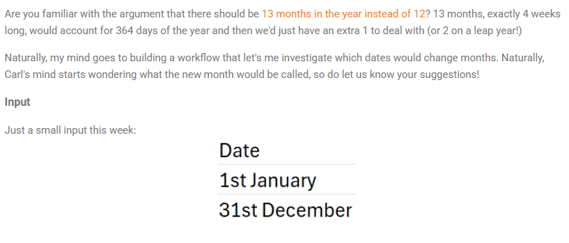
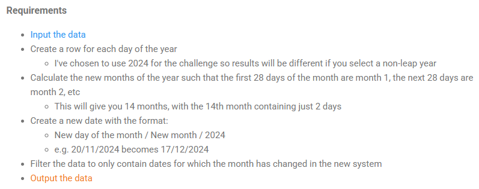

## 2024 Week 11 - 13 months in a year




```python
import pandas as pd
import numpy as np
```


```python
df = pd.read_csv('2024W11 Input.csv')
df.head()
```


<div>
<style scoped>
    .dataframe tbody tr th:only-of-type {
        vertical-align: middle;
    }

    .dataframe tbody tr th {
        vertical-align: top;
    }

    .dataframe thead th {
        text-align: right;
    }
</style>
<table border="1" class="dataframe">
  <thead>
    <tr style="text-align: right;">
      <th></th>
      <th>Date</th>
    </tr>
  </thead>
  <tbody>
    <tr>
      <th>0</th>
      <td>1st January</td>
    </tr>
    <tr>
      <th>1</th>
      <td>31st December</td>
    </tr>
  </tbody>
</table>
</div>


#### Create a row for each day of the year
I've chosen to use 2024 for the challenge so results will be different if you select a non-leap year


```python
df['Date'] = df['Date'] + ' 2024'
df.Date
```


    0      1st January 2024
    1    31st December 2024
    Name: Date, dtype: object


```python
df.Date = pd.to_datetime(df.Date)
df.Date
```


    0   2024-01-01
    1   2024-12-31
    Name: Date, dtype: datetime64[ns]


```python
date = pd.Series(pd.date_range(start=df.Date[0], end=df.Date[1])).values
df = pd.DataFrame({'Date': date})
```


```python
df
```


<div>
<style scoped>
    .dataframe tbody tr th:only-of-type {
        vertical-align: middle;
    }

    .dataframe tbody tr th {
        vertical-align: top;
    }

    .dataframe thead th {
        text-align: right;
    }
</style>
<table border="1" class="dataframe">
  <thead>
    <tr style="text-align: right;">
      <th></th>
      <th>Date</th>
    </tr>
  </thead>
  <tbody>
    <tr>
      <th>0</th>
      <td>2024-01-01</td>
    </tr>
    <tr>
      <th>1</th>
      <td>2024-01-02</td>
    </tr>
    <tr>
      <th>2</th>
      <td>2024-01-03</td>
    </tr>
    <tr>
      <th>3</th>
      <td>2024-01-04</td>
    </tr>
    <tr>
      <th>4</th>
      <td>2024-01-05</td>
    </tr>
    <tr>
      <th>...</th>
      <td>...</td>
    </tr>
    <tr>
      <th>361</th>
      <td>2024-12-27</td>
    </tr>
    <tr>
      <th>362</th>
      <td>2024-12-28</td>
    </tr>
    <tr>
      <th>363</th>
      <td>2024-12-29</td>
    </tr>
    <tr>
      <th>364</th>
      <td>2024-12-30</td>
    </tr>
    <tr>
      <th>365</th>
      <td>2024-12-31</td>
    </tr>
  </tbody>
</table>
<p>366 rows × 1 columns</p>
</div>


#### Calculate the new months of the year such that the first 28 days of the month are month 1, the next 28 days are month 2, etc
This will give you 14 months, with the 14th month containing just 2 days


```python
df['Month'] = df.Date.dt.month
df['Day of Year'] = df.Date.dt.dayofyear
```


```python
df['New Month'] = np.ceil(df['Day of Year'] / 28).astype(int)
df['New day of Month'] = df.groupby(['New Month'])['Date'].rank('first').astype(int)
df.head()
```


<div>
<style scoped>
    .dataframe tbody tr th:only-of-type {
        vertical-align: middle;
    }

    .dataframe tbody tr th {
        vertical-align: top;
    }

    .dataframe thead th {
        text-align: right;
    }
</style>
<table border="1" class="dataframe">
  <thead>
    <tr style="text-align: right;">
      <th></th>
      <th>Date</th>
      <th>Month</th>
      <th>Day of Year</th>
      <th>New Month</th>
      <th>New day of Month</th>
    </tr>
  </thead>
  <tbody>
    <tr>
      <th>0</th>
      <td>2024-01-01</td>
      <td>1</td>
      <td>1</td>
      <td>1</td>
      <td>1</td>
    </tr>
    <tr>
      <th>1</th>
      <td>2024-01-02</td>
      <td>1</td>
      <td>2</td>
      <td>1</td>
      <td>2</td>
    </tr>
    <tr>
      <th>2</th>
      <td>2024-01-03</td>
      <td>1</td>
      <td>3</td>
      <td>1</td>
      <td>3</td>
    </tr>
    <tr>
      <th>3</th>
      <td>2024-01-04</td>
      <td>1</td>
      <td>4</td>
      <td>1</td>
      <td>4</td>
    </tr>
    <tr>
      <th>4</th>
      <td>2024-01-05</td>
      <td>1</td>
      <td>5</td>
      <td>1</td>
      <td>5</td>
    </tr>
  </tbody>
</table>
</div>


#### Create a new date with the format:
- New day of the month / New month / 2024
- e.g. 20/11/2024 becomes 17/12/2024


```python
df['New Date'] = df['New day of Month'].astype(str).str.pad(2, fillchar='0') + '/' + \
                df['New Month'].astype(str).str.pad(2, fillchar='0') + '/' + '2024'
df.head()
```


<div>
<style scoped>
    .dataframe tbody tr th:only-of-type {
        vertical-align: middle;
    }

    .dataframe tbody tr th {
        vertical-align: top;
    }

    .dataframe thead th {
        text-align: right;
    }
</style>
<table border="1" class="dataframe">
  <thead>
    <tr style="text-align: right;">
      <th></th>
      <th>Date</th>
      <th>Month</th>
      <th>Day of Year</th>
      <th>New Month</th>
      <th>New day of Month</th>
      <th>New Date</th>
    </tr>
  </thead>
  <tbody>
    <tr>
      <th>0</th>
      <td>2024-01-01</td>
      <td>1</td>
      <td>1</td>
      <td>1</td>
      <td>1</td>
      <td>01/01/2024</td>
    </tr>
    <tr>
      <th>1</th>
      <td>2024-01-02</td>
      <td>1</td>
      <td>2</td>
      <td>1</td>
      <td>2</td>
      <td>02/01/2024</td>
    </tr>
    <tr>
      <th>2</th>
      <td>2024-01-03</td>
      <td>1</td>
      <td>3</td>
      <td>1</td>
      <td>3</td>
      <td>03/01/2024</td>
    </tr>
    <tr>
      <th>3</th>
      <td>2024-01-04</td>
      <td>1</td>
      <td>4</td>
      <td>1</td>
      <td>4</td>
      <td>04/01/2024</td>
    </tr>
    <tr>
      <th>4</th>
      <td>2024-01-05</td>
      <td>1</td>
      <td>5</td>
      <td>1</td>
      <td>5</td>
      <td>05/01/2024</td>
    </tr>
  </tbody>
</table>
</div>


#### Filter the data to only contain dates for which the month has changed in the new system


```python
month_changed = df[df['Month'] != df['New Month']][['Date', 'New Date']]
month_changed
```


<div>
<style scoped>
    .dataframe tbody tr th:only-of-type {
        vertical-align: middle;
    }

    .dataframe tbody tr th {
        vertical-align: top;
    }

    .dataframe thead th {
        text-align: right;
    }
</style>
<table border="1" class="dataframe">
  <thead>
    <tr style="text-align: right;">
      <th></th>
      <th>Date</th>
      <th>New Date</th>
    </tr>
  </thead>
  <tbody>
    <tr>
      <th>28</th>
      <td>2024-01-29</td>
      <td>01/02/2024</td>
    </tr>
    <tr>
      <th>29</th>
      <td>2024-01-30</td>
      <td>02/02/2024</td>
    </tr>
    <tr>
      <th>30</th>
      <td>2024-01-31</td>
      <td>03/02/2024</td>
    </tr>
    <tr>
      <th>56</th>
      <td>2024-02-26</td>
      <td>01/03/2024</td>
    </tr>
    <tr>
      <th>57</th>
      <td>2024-02-27</td>
      <td>02/03/2024</td>
    </tr>
    <tr>
      <th>...</th>
      <td>...</td>
      <td>...</td>
    </tr>
    <tr>
      <th>361</th>
      <td>2024-12-27</td>
      <td>26/13/2024</td>
    </tr>
    <tr>
      <th>362</th>
      <td>2024-12-28</td>
      <td>27/13/2024</td>
    </tr>
    <tr>
      <th>363</th>
      <td>2024-12-29</td>
      <td>28/13/2024</td>
    </tr>
    <tr>
      <th>364</th>
      <td>2024-12-30</td>
      <td>01/14/2024</td>
    </tr>
    <tr>
      <th>365</th>
      <td>2024-12-31</td>
      <td>02/14/2024</td>
    </tr>
  </tbody>
</table>
<p>190 rows × 2 columns</p>
</div>


