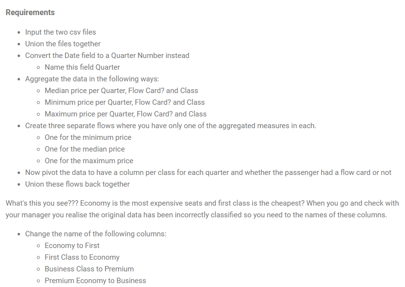

## 2024: Week 2 - Average Price Analysis
It's the second week of our introductory challenges. This week the challenge will involve unions, aggregation and reshaping data.
The input data set for this week is the output from week one.




```python
import pandas as pd
```


```python
flow_card = pd.read_csv('./data/PD 2024 Wk 1 Output Flow Card.csv')
non_flow_card = pd.read_csv('./data/PD 2024 Wk 1 Output Non-Flow Card.csv')

```


```python
flow_card.head(2)
```


<div>
<style scoped>
    .dataframe tbody tr th:only-of-type {
        vertical-align: middle;
    }

    .dataframe tbody tr th {
        vertical-align: top;
    }

    .dataframe thead th {
        text-align: right;
    }
</style>
<table border="1" class="dataframe">
  <thead>
    <tr style="text-align: right;">
      <th></th>
      <th>Date</th>
      <th>Flight Number</th>
      <th>From</th>
      <th>To</th>
      <th>Class</th>
      <th>Price</th>
      <th>Flow Card?</th>
      <th>Bags Checked</th>
      <th>Meal Type</th>
    </tr>
  </thead>
  <tbody>
    <tr>
      <th>0</th>
      <td>22/07/2024</td>
      <td>PA010</td>
      <td>Tokyo</td>
      <td>New York</td>
      <td>Economy</td>
      <td>2380.0</td>
      <td>Yes</td>
      <td>0</td>
      <td>Egg Free</td>
    </tr>
    <tr>
      <th>1</th>
      <td>20/04/2024</td>
      <td>PA002</td>
      <td>New York</td>
      <td>London</td>
      <td>Economy</td>
      <td>3490.0</td>
      <td>Yes</td>
      <td>1</td>
      <td>Vegan</td>
    </tr>
  </tbody>
</table>
</div>


```python
non_flow_card.head(2)
```


<div>
<style scoped>
    .dataframe tbody tr th:only-of-type {
        vertical-align: middle;
    }

    .dataframe tbody tr th {
        vertical-align: top;
    }

    .dataframe thead th {
        text-align: right;
    }
</style>
<table border="1" class="dataframe">
  <thead>
    <tr style="text-align: right;">
      <th></th>
      <th>Date</th>
      <th>Flight Number</th>
      <th>From</th>
      <th>To</th>
      <th>Class</th>
      <th>Price</th>
      <th>Flow Card?</th>
      <th>Bags Checked</th>
      <th>Meal Type</th>
    </tr>
  </thead>
  <tbody>
    <tr>
      <th>0</th>
      <td>28/09/2024</td>
      <td>PA008</td>
      <td>Perth</td>
      <td>New York</td>
      <td>Economy</td>
      <td>1855.0</td>
      <td>No</td>
      <td>2</td>
      <td>Vegetarian</td>
    </tr>
    <tr>
      <th>1</th>
      <td>01/10/2024</td>
      <td>PA008</td>
      <td>Perth</td>
      <td>New York</td>
      <td>Business Class</td>
      <td>634.8</td>
      <td>No</td>
      <td>0</td>
      <td>Vegetarian</td>
    </tr>
  </tbody>
</table>
</div>


### 1. Union the files together


```python
df = pd.concat((flow_card, non_flow_card), axis=0, ignore_index=True)
```


```python
df.Date = pd.to_datetime(df.Date, dayfirst=True)
```


```python
df.Date = df.Date.dt.to_period('Q').dt.strftime('%q')
df.rename(columns={'Date': 'Quarter'}, inplace=True)
df.head()
```


<div>
<style scoped>
    .dataframe tbody tr th:only-of-type {
        vertical-align: middle;
    }

    .dataframe tbody tr th {
        vertical-align: top;
    }

    .dataframe thead th {
        text-align: right;
    }
</style>
<table border="1" class="dataframe">
  <thead>
    <tr style="text-align: right;">
      <th></th>
      <th>Quarter</th>
      <th>Flight Number</th>
      <th>From</th>
      <th>To</th>
      <th>Class</th>
      <th>Price</th>
      <th>Flow Card?</th>
      <th>Bags Checked</th>
      <th>Meal Type</th>
    </tr>
  </thead>
  <tbody>
    <tr>
      <th>0</th>
      <td>3</td>
      <td>PA010</td>
      <td>Tokyo</td>
      <td>New York</td>
      <td>Economy</td>
      <td>2380.0</td>
      <td>Yes</td>
      <td>0</td>
      <td>Egg Free</td>
    </tr>
    <tr>
      <th>1</th>
      <td>2</td>
      <td>PA002</td>
      <td>New York</td>
      <td>London</td>
      <td>Economy</td>
      <td>3490.0</td>
      <td>Yes</td>
      <td>1</td>
      <td>Vegan</td>
    </tr>
    <tr>
      <th>2</th>
      <td>1</td>
      <td>PA010</td>
      <td>Tokyo</td>
      <td>New York</td>
      <td>Premium Economy</td>
      <td>825.0</td>
      <td>Yes</td>
      <td>1</td>
      <td>Vegetarian</td>
    </tr>
    <tr>
      <th>3</th>
      <td>2</td>
      <td>PA006</td>
      <td>Tokyo</td>
      <td>London</td>
      <td>First Class</td>
      <td>618.0</td>
      <td>Yes</td>
      <td>3</td>
      <td>Vegan</td>
    </tr>
    <tr>
      <th>4</th>
      <td>1</td>
      <td>PA004</td>
      <td>Perth</td>
      <td>London</td>
      <td>First Class</td>
      <td>446.0</td>
      <td>Yes</td>
      <td>1</td>
      <td>Nut Free</td>
    </tr>
  </tbody>
</table>
</div>


```python
df.groupby(['Quarter', 'Flow Card?', 'Class']).agg({'Price':['min', 'median', 'max']})
```


<div>
<style scoped>
    .dataframe tbody tr th:only-of-type {
        vertical-align: middle;
    }

    .dataframe tbody tr th {
        vertical-align: top;
    }

    .dataframe thead tr th {
        text-align: left;
    }

    .dataframe thead tr:last-of-type th {
        text-align: right;
    }
</style>
<table border="1" class="dataframe">
  <thead>
    <tr>
      <th></th>
      <th></th>
      <th></th>
      <th colspan="3" halign="left">Price</th>
    </tr>
    <tr>
      <th></th>
      <th></th>
      <th></th>
      <th>min</th>
      <th>median</th>
      <th>max</th>
    </tr>
    <tr>
      <th>Quarter</th>
      <th>Flow Card?</th>
      <th>Class</th>
      <th></th>
      <th></th>
      <th></th>
    </tr>
  </thead>
  <tbody>
    <tr>
      <th rowspan="8" valign="top">1</th>
      <th rowspan="4" valign="top">No</th>
      <th>Business Class</th>
      <td>241.2</td>
      <td>574.80</td>
      <td>834.0</td>
    </tr>
    <tr>
      <th>Economy</th>
      <td>1030.0</td>
      <td>2340.00</td>
      <td>3455.0</td>
    </tr>
    <tr>
      <th>First Class</th>
      <td>204.0</td>
      <td>438.00</td>
      <td>699.0</td>
    </tr>
    <tr>
      <th>Premium Economy</th>
      <td>515.0</td>
      <td>1075.00</td>
      <td>1702.5</td>
    </tr>
    <tr>
      <th rowspan="4" valign="top">Yes</th>
      <th>Business Class</th>
      <td>249.6</td>
      <td>523.20</td>
      <td>840.0</td>
    </tr>
    <tr>
      <th>Economy</th>
      <td>1020.0</td>
      <td>2325.00</td>
      <td>3500.0</td>
    </tr>
    <tr>
      <th>First Class</th>
      <td>201.0</td>
      <td>447.50</td>
      <td>698.0</td>
    </tr>
    <tr>
      <th>Premium Economy</th>
      <td>502.5</td>
      <td>1160.00</td>
      <td>1737.5</td>
    </tr>
    <tr>
      <th rowspan="8" valign="top">2</th>
      <th rowspan="4" valign="top">No</th>
      <th>Business Class</th>
      <td>240.0</td>
      <td>553.80</td>
      <td>828.0</td>
    </tr>
    <tr>
      <th>Economy</th>
      <td>1000.0</td>
      <td>2325.00</td>
      <td>3480.0</td>
    </tr>
    <tr>
      <th>First Class</th>
      <td>202.0</td>
      <td>445.00</td>
      <td>694.0</td>
    </tr>
    <tr>
      <th>Premium Economy</th>
      <td>507.5</td>
      <td>1205.00</td>
      <td>1745.0</td>
    </tr>
    <tr>
      <th rowspan="4" valign="top">Yes</th>
      <th>Business Class</th>
      <td>240.0</td>
      <td>517.80</td>
      <td>840.0</td>
    </tr>
    <tr>
      <th>Economy</th>
      <td>1020.0</td>
      <td>2290.00</td>
      <td>3490.0</td>
    </tr>
    <tr>
      <th>First Class</th>
      <td>200.0</td>
      <td>459.00</td>
      <td>696.0</td>
    </tr>
    <tr>
      <th>Premium Economy</th>
      <td>500.0</td>
      <td>1071.25</td>
      <td>1737.5</td>
    </tr>
    <tr>
      <th rowspan="8" valign="top">3</th>
      <th rowspan="4" valign="top">No</th>
      <th>Business Class</th>
      <td>240.0</td>
      <td>490.80</td>
      <td>838.8</td>
    </tr>
    <tr>
      <th>Economy</th>
      <td>1000.0</td>
      <td>2285.00</td>
      <td>3475.0</td>
    </tr>
    <tr>
      <th>First Class</th>
      <td>201.0</td>
      <td>487.00</td>
      <td>691.0</td>
    </tr>
    <tr>
      <th>Premium Economy</th>
      <td>517.5</td>
      <td>1125.00</td>
      <td>1747.5</td>
    </tr>
    <tr>
      <th rowspan="4" valign="top">Yes</th>
      <th>Business Class</th>
      <td>241.2</td>
      <td>553.80</td>
      <td>840.0</td>
    </tr>
    <tr>
      <th>Economy</th>
      <td>1005.0</td>
      <td>2347.50</td>
      <td>3495.0</td>
    </tr>
    <tr>
      <th>First Class</th>
      <td>206.0</td>
      <td>457.00</td>
      <td>697.0</td>
    </tr>
    <tr>
      <th>Premium Economy</th>
      <td>502.5</td>
      <td>1090.00</td>
      <td>1750.0</td>
    </tr>
    <tr>
      <th rowspan="8" valign="top">4</th>
      <th rowspan="4" valign="top">No</th>
      <th>Business Class</th>
      <td>240.0</td>
      <td>555.60</td>
      <td>835.2</td>
    </tr>
    <tr>
      <th>Economy</th>
      <td>1015.0</td>
      <td>2202.50</td>
      <td>3465.0</td>
    </tr>
    <tr>
      <th>First Class</th>
      <td>200.0</td>
      <td>428.00</td>
      <td>698.0</td>
    </tr>
    <tr>
      <th>Premium Economy</th>
      <td>510.0</td>
      <td>1062.50</td>
      <td>1730.0</td>
    </tr>
    <tr>
      <th rowspan="4" valign="top">Yes</th>
      <th>Business Class</th>
      <td>249.6</td>
      <td>522.60</td>
      <td>834.0</td>
    </tr>
    <tr>
      <th>Economy</th>
      <td>1030.0</td>
      <td>2212.50</td>
      <td>3460.0</td>
    </tr>
    <tr>
      <th>First Class</th>
      <td>205.0</td>
      <td>424.00</td>
      <td>697.0</td>
    </tr>
    <tr>
      <th>Premium Economy</th>
      <td>505.0</td>
      <td>1108.75</td>
      <td>1722.5</td>
    </tr>
  </tbody>
</table>
</div>


```python
min_price = df.groupby(['Quarter', 'Flow Card?', 'Class'], as_index=False).Price.min()
med_price = df.groupby(['Quarter', 'Flow Card?', 'Class'], as_index=False).Price.median()
max_price = df.groupby(['Quarter', 'Flow Card?', 'Class'], as_index=False).Price.max()
```


```python
min_price.head(4)
```


<div>
<style scoped>
    .dataframe tbody tr th:only-of-type {
        vertical-align: middle;
    }

    .dataframe tbody tr th {
        vertical-align: top;
    }

    .dataframe thead th {
        text-align: right;
    }
</style>
<table border="1" class="dataframe">
  <thead>
    <tr style="text-align: right;">
      <th></th>
      <th>Quarter</th>
      <th>Flow Card?</th>
      <th>Class</th>
      <th>Price</th>
    </tr>
  </thead>
  <tbody>
    <tr>
      <th>0</th>
      <td>1</td>
      <td>No</td>
      <td>Business Class</td>
      <td>241.2</td>
    </tr>
    <tr>
      <th>1</th>
      <td>1</td>
      <td>No</td>
      <td>Economy</td>
      <td>1030.0</td>
    </tr>
    <tr>
      <th>2</th>
      <td>1</td>
      <td>No</td>
      <td>First Class</td>
      <td>204.0</td>
    </tr>
    <tr>
      <th>3</th>
      <td>1</td>
      <td>No</td>
      <td>Premium Economy</td>
      <td>515.0</td>
    </tr>
  </tbody>
</table>
</div>


```python
med_price.head(4)
```


<div>
<style scoped>
    .dataframe tbody tr th:only-of-type {
        vertical-align: middle;
    }

    .dataframe tbody tr th {
        vertical-align: top;
    }

    .dataframe thead th {
        text-align: right;
    }
</style>
<table border="1" class="dataframe">
  <thead>
    <tr style="text-align: right;">
      <th></th>
      <th>Quarter</th>
      <th>Flow Card?</th>
      <th>Class</th>
      <th>Price</th>
    </tr>
  </thead>
  <tbody>
    <tr>
      <th>0</th>
      <td>1</td>
      <td>No</td>
      <td>Business Class</td>
      <td>574.8</td>
    </tr>
    <tr>
      <th>1</th>
      <td>1</td>
      <td>No</td>
      <td>Economy</td>
      <td>2340.0</td>
    </tr>
    <tr>
      <th>2</th>
      <td>1</td>
      <td>No</td>
      <td>First Class</td>
      <td>438.0</td>
    </tr>
    <tr>
      <th>3</th>
      <td>1</td>
      <td>No</td>
      <td>Premium Economy</td>
      <td>1075.0</td>
    </tr>
  </tbody>
</table>
</div>


```python
max_price.head(4)
```


<div>
<style scoped>
    .dataframe tbody tr th:only-of-type {
        vertical-align: middle;
    }

    .dataframe tbody tr th {
        vertical-align: top;
    }

    .dataframe thead th {
        text-align: right;
    }
</style>
<table border="1" class="dataframe">
  <thead>
    <tr style="text-align: right;">
      <th></th>
      <th>Quarter</th>
      <th>Flow Card?</th>
      <th>Class</th>
      <th>Price</th>
    </tr>
  </thead>
  <tbody>
    <tr>
      <th>0</th>
      <td>1</td>
      <td>No</td>
      <td>Business Class</td>
      <td>834.0</td>
    </tr>
    <tr>
      <th>1</th>
      <td>1</td>
      <td>No</td>
      <td>Economy</td>
      <td>3455.0</td>
    </tr>
    <tr>
      <th>2</th>
      <td>1</td>
      <td>No</td>
      <td>First Class</td>
      <td>699.0</td>
    </tr>
    <tr>
      <th>3</th>
      <td>1</td>
      <td>No</td>
      <td>Premium Economy</td>
      <td>1702.5</td>
    </tr>
  </tbody>
</table>
</div>


```python
min_flow = min_price.pivot_table(index=['Flow Card?', 'Quarter'], columns='Class', values='Price', aggfunc='first').reset_index()
min_flow['agg_price'] = 'min'
min_flow.head(4)
```


<div>
<style scoped>
    .dataframe tbody tr th:only-of-type {
        vertical-align: middle;
    }

    .dataframe tbody tr th {
        vertical-align: top;
    }

    .dataframe thead th {
        text-align: right;
    }
</style>
<table border="1" class="dataframe">
  <thead>
    <tr style="text-align: right;">
      <th>Class</th>
      <th>Flow Card?</th>
      <th>Quarter</th>
      <th>Business Class</th>
      <th>Economy</th>
      <th>First Class</th>
      <th>Premium Economy</th>
      <th>agg_price</th>
    </tr>
  </thead>
  <tbody>
    <tr>
      <th>0</th>
      <td>No</td>
      <td>1</td>
      <td>241.2</td>
      <td>1030.0</td>
      <td>204.0</td>
      <td>515.0</td>
      <td>min</td>
    </tr>
    <tr>
      <th>1</th>
      <td>No</td>
      <td>2</td>
      <td>240.0</td>
      <td>1000.0</td>
      <td>202.0</td>
      <td>507.5</td>
      <td>min</td>
    </tr>
    <tr>
      <th>2</th>
      <td>No</td>
      <td>3</td>
      <td>240.0</td>
      <td>1000.0</td>
      <td>201.0</td>
      <td>517.5</td>
      <td>min</td>
    </tr>
    <tr>
      <th>3</th>
      <td>No</td>
      <td>4</td>
      <td>240.0</td>
      <td>1015.0</td>
      <td>200.0</td>
      <td>510.0</td>
      <td>min</td>
    </tr>
  </tbody>
</table>
</div>


```python
med_flow = med_price.pivot_table(index=['Flow Card?', 'Quarter'], columns='Class', values='Price', aggfunc='first').reset_index()
med_flow['agg_price'] = 'median'
med_flow.head(4)
```


<div>
<style scoped>
    .dataframe tbody tr th:only-of-type {
        vertical-align: middle;
    }

    .dataframe tbody tr th {
        vertical-align: top;
    }

    .dataframe thead th {
        text-align: right;
    }
</style>
<table border="1" class="dataframe">
  <thead>
    <tr style="text-align: right;">
      <th>Class</th>
      <th>Flow Card?</th>
      <th>Quarter</th>
      <th>Business Class</th>
      <th>Economy</th>
      <th>First Class</th>
      <th>Premium Economy</th>
      <th>agg_price</th>
    </tr>
  </thead>
  <tbody>
    <tr>
      <th>0</th>
      <td>No</td>
      <td>1</td>
      <td>574.8</td>
      <td>2340.0</td>
      <td>438.0</td>
      <td>1075.0</td>
      <td>median</td>
    </tr>
    <tr>
      <th>1</th>
      <td>No</td>
      <td>2</td>
      <td>553.8</td>
      <td>2325.0</td>
      <td>445.0</td>
      <td>1205.0</td>
      <td>median</td>
    </tr>
    <tr>
      <th>2</th>
      <td>No</td>
      <td>3</td>
      <td>490.8</td>
      <td>2285.0</td>
      <td>487.0</td>
      <td>1125.0</td>
      <td>median</td>
    </tr>
    <tr>
      <th>3</th>
      <td>No</td>
      <td>4</td>
      <td>555.6</td>
      <td>2202.5</td>
      <td>428.0</td>
      <td>1062.5</td>
      <td>median</td>
    </tr>
  </tbody>
</table>
</div>


```python
max_flow = max_price.pivot_table(index=['Flow Card?', 'Quarter'], columns='Class', values='Price', aggfunc='first').reset_index()
max_flow['agg_price'] = 'max'
max_flow.head(4)
```


<div>
<style scoped>
    .dataframe tbody tr th:only-of-type {
        vertical-align: middle;
    }

    .dataframe tbody tr th {
        vertical-align: top;
    }

    .dataframe thead th {
        text-align: right;
    }
</style>
<table border="1" class="dataframe">
  <thead>
    <tr style="text-align: right;">
      <th>Class</th>
      <th>Flow Card?</th>
      <th>Quarter</th>
      <th>Business Class</th>
      <th>Economy</th>
      <th>First Class</th>
      <th>Premium Economy</th>
      <th>agg_price</th>
    </tr>
  </thead>
  <tbody>
    <tr>
      <th>0</th>
      <td>No</td>
      <td>1</td>
      <td>834.0</td>
      <td>3455.0</td>
      <td>699.0</td>
      <td>1702.5</td>
      <td>max</td>
    </tr>
    <tr>
      <th>1</th>
      <td>No</td>
      <td>2</td>
      <td>828.0</td>
      <td>3480.0</td>
      <td>694.0</td>
      <td>1745.0</td>
      <td>max</td>
    </tr>
    <tr>
      <th>2</th>
      <td>No</td>
      <td>3</td>
      <td>838.8</td>
      <td>3475.0</td>
      <td>691.0</td>
      <td>1747.5</td>
      <td>max</td>
    </tr>
    <tr>
      <th>3</th>
      <td>No</td>
      <td>4</td>
      <td>835.2</td>
      <td>3465.0</td>
      <td>698.0</td>
      <td>1730.0</td>
      <td>max</td>
    </tr>
  </tbody>
</table>
</div>


```python
flows = pd.concat((min_flow, med_flow, max_flow), ignore_index=True)
flows
```


<div>
<style scoped>
    .dataframe tbody tr th:only-of-type {
        vertical-align: middle;
    }

    .dataframe tbody tr th {
        vertical-align: top;
    }

    .dataframe thead th {
        text-align: right;
    }
</style>
<table border="1" class="dataframe">
  <thead>
    <tr style="text-align: right;">
      <th>Class</th>
      <th>Flow Card?</th>
      <th>Quarter</th>
      <th>Business Class</th>
      <th>Economy</th>
      <th>First Class</th>
      <th>Premium Economy</th>
      <th>agg_price</th>
    </tr>
  </thead>
  <tbody>
    <tr>
      <th>0</th>
      <td>No</td>
      <td>1</td>
      <td>241.2</td>
      <td>1030.0</td>
      <td>204.0</td>
      <td>515.00</td>
      <td>min</td>
    </tr>
    <tr>
      <th>1</th>
      <td>No</td>
      <td>2</td>
      <td>240.0</td>
      <td>1000.0</td>
      <td>202.0</td>
      <td>507.50</td>
      <td>min</td>
    </tr>
    <tr>
      <th>2</th>
      <td>No</td>
      <td>3</td>
      <td>240.0</td>
      <td>1000.0</td>
      <td>201.0</td>
      <td>517.50</td>
      <td>min</td>
    </tr>
    <tr>
      <th>3</th>
      <td>No</td>
      <td>4</td>
      <td>240.0</td>
      <td>1015.0</td>
      <td>200.0</td>
      <td>510.00</td>
      <td>min</td>
    </tr>
    <tr>
      <th>4</th>
      <td>Yes</td>
      <td>1</td>
      <td>249.6</td>
      <td>1020.0</td>
      <td>201.0</td>
      <td>502.50</td>
      <td>min</td>
    </tr>
    <tr>
      <th>5</th>
      <td>Yes</td>
      <td>2</td>
      <td>240.0</td>
      <td>1020.0</td>
      <td>200.0</td>
      <td>500.00</td>
      <td>min</td>
    </tr>
    <tr>
      <th>6</th>
      <td>Yes</td>
      <td>3</td>
      <td>241.2</td>
      <td>1005.0</td>
      <td>206.0</td>
      <td>502.50</td>
      <td>min</td>
    </tr>
    <tr>
      <th>7</th>
      <td>Yes</td>
      <td>4</td>
      <td>249.6</td>
      <td>1030.0</td>
      <td>205.0</td>
      <td>505.00</td>
      <td>min</td>
    </tr>
    <tr>
      <th>8</th>
      <td>No</td>
      <td>1</td>
      <td>574.8</td>
      <td>2340.0</td>
      <td>438.0</td>
      <td>1075.00</td>
      <td>median</td>
    </tr>
    <tr>
      <th>9</th>
      <td>No</td>
      <td>2</td>
      <td>553.8</td>
      <td>2325.0</td>
      <td>445.0</td>
      <td>1205.00</td>
      <td>median</td>
    </tr>
    <tr>
      <th>10</th>
      <td>No</td>
      <td>3</td>
      <td>490.8</td>
      <td>2285.0</td>
      <td>487.0</td>
      <td>1125.00</td>
      <td>median</td>
    </tr>
    <tr>
      <th>11</th>
      <td>No</td>
      <td>4</td>
      <td>555.6</td>
      <td>2202.5</td>
      <td>428.0</td>
      <td>1062.50</td>
      <td>median</td>
    </tr>
    <tr>
      <th>12</th>
      <td>Yes</td>
      <td>1</td>
      <td>523.2</td>
      <td>2325.0</td>
      <td>447.5</td>
      <td>1160.00</td>
      <td>median</td>
    </tr>
    <tr>
      <th>13</th>
      <td>Yes</td>
      <td>2</td>
      <td>517.8</td>
      <td>2290.0</td>
      <td>459.0</td>
      <td>1071.25</td>
      <td>median</td>
    </tr>
    <tr>
      <th>14</th>
      <td>Yes</td>
      <td>3</td>
      <td>553.8</td>
      <td>2347.5</td>
      <td>457.0</td>
      <td>1090.00</td>
      <td>median</td>
    </tr>
    <tr>
      <th>15</th>
      <td>Yes</td>
      <td>4</td>
      <td>522.6</td>
      <td>2212.5</td>
      <td>424.0</td>
      <td>1108.75</td>
      <td>median</td>
    </tr>
    <tr>
      <th>16</th>
      <td>No</td>
      <td>1</td>
      <td>834.0</td>
      <td>3455.0</td>
      <td>699.0</td>
      <td>1702.50</td>
      <td>max</td>
    </tr>
    <tr>
      <th>17</th>
      <td>No</td>
      <td>2</td>
      <td>828.0</td>
      <td>3480.0</td>
      <td>694.0</td>
      <td>1745.00</td>
      <td>max</td>
    </tr>
    <tr>
      <th>18</th>
      <td>No</td>
      <td>3</td>
      <td>838.8</td>
      <td>3475.0</td>
      <td>691.0</td>
      <td>1747.50</td>
      <td>max</td>
    </tr>
    <tr>
      <th>19</th>
      <td>No</td>
      <td>4</td>
      <td>835.2</td>
      <td>3465.0</td>
      <td>698.0</td>
      <td>1730.00</td>
      <td>max</td>
    </tr>
    <tr>
      <th>20</th>
      <td>Yes</td>
      <td>1</td>
      <td>840.0</td>
      <td>3500.0</td>
      <td>698.0</td>
      <td>1737.50</td>
      <td>max</td>
    </tr>
    <tr>
      <th>21</th>
      <td>Yes</td>
      <td>2</td>
      <td>840.0</td>
      <td>3490.0</td>
      <td>696.0</td>
      <td>1737.50</td>
      <td>max</td>
    </tr>
    <tr>
      <th>22</th>
      <td>Yes</td>
      <td>3</td>
      <td>840.0</td>
      <td>3495.0</td>
      <td>697.0</td>
      <td>1750.00</td>
      <td>max</td>
    </tr>
    <tr>
      <th>23</th>
      <td>Yes</td>
      <td>4</td>
      <td>834.0</td>
      <td>3460.0</td>
      <td>697.0</td>
      <td>1722.50</td>
      <td>max</td>
    </tr>
  </tbody>
</table>
</div>


```python
new_classes = {'Economy': 'First', 'First Class': 'Economy', 'Business Class': 'Premium', 'Premium Economy': 'Business'}
flows = flows.rename(columns=new_classes)
```


```python
flows = flows[['Flow Card?', 'Quarter', 'Economy', 'Premium', 'Business', 'First', 'agg_price']]
flows.head()
```


<div>
<style scoped>
    .dataframe tbody tr th:only-of-type {
        vertical-align: middle;
    }

    .dataframe tbody tr th {
        vertical-align: top;
    }

    .dataframe thead th {
        text-align: right;
    }
</style>
<table border="1" class="dataframe">
  <thead>
    <tr style="text-align: right;">
      <th>Class</th>
      <th>Flow Card?</th>
      <th>Quarter</th>
      <th>Economy</th>
      <th>Premium</th>
      <th>Business</th>
      <th>First</th>
      <th>agg_price</th>
    </tr>
  </thead>
  <tbody>
    <tr>
      <th>0</th>
      <td>No</td>
      <td>1</td>
      <td>204.0</td>
      <td>241.2</td>
      <td>515.0</td>
      <td>1030.0</td>
      <td>min</td>
    </tr>
    <tr>
      <th>1</th>
      <td>No</td>
      <td>2</td>
      <td>202.0</td>
      <td>240.0</td>
      <td>507.5</td>
      <td>1000.0</td>
      <td>min</td>
    </tr>
    <tr>
      <th>2</th>
      <td>No</td>
      <td>3</td>
      <td>201.0</td>
      <td>240.0</td>
      <td>517.5</td>
      <td>1000.0</td>
      <td>min</td>
    </tr>
    <tr>
      <th>3</th>
      <td>No</td>
      <td>4</td>
      <td>200.0</td>
      <td>240.0</td>
      <td>510.0</td>
      <td>1015.0</td>
      <td>min</td>
    </tr>
    <tr>
      <th>4</th>
      <td>Yes</td>
      <td>1</td>
      <td>201.0</td>
      <td>249.6</td>
      <td>502.5</td>
      <td>1020.0</td>
      <td>min</td>
    </tr>
  </tbody>
</table>
</div>


```python
flows[flows.agg_price == 'median']
```


<div>
<style scoped>
    .dataframe tbody tr th:only-of-type {
        vertical-align: middle;
    }

    .dataframe tbody tr th {
        vertical-align: top;
    }

    .dataframe thead th {
        text-align: right;
    }
</style>
<table border="1" class="dataframe">
  <thead>
    <tr style="text-align: right;">
      <th>Class</th>
      <th>Flow Card?</th>
      <th>Quarter</th>
      <th>Economy</th>
      <th>Premium</th>
      <th>Business</th>
      <th>First</th>
      <th>agg_price</th>
    </tr>
  </thead>
  <tbody>
    <tr>
      <th>8</th>
      <td>No</td>
      <td>1</td>
      <td>438.0</td>
      <td>574.8</td>
      <td>1075.00</td>
      <td>2340.0</td>
      <td>median</td>
    </tr>
    <tr>
      <th>9</th>
      <td>No</td>
      <td>2</td>
      <td>445.0</td>
      <td>553.8</td>
      <td>1205.00</td>
      <td>2325.0</td>
      <td>median</td>
    </tr>
    <tr>
      <th>10</th>
      <td>No</td>
      <td>3</td>
      <td>487.0</td>
      <td>490.8</td>
      <td>1125.00</td>
      <td>2285.0</td>
      <td>median</td>
    </tr>
    <tr>
      <th>11</th>
      <td>No</td>
      <td>4</td>
      <td>428.0</td>
      <td>555.6</td>
      <td>1062.50</td>
      <td>2202.5</td>
      <td>median</td>
    </tr>
    <tr>
      <th>12</th>
      <td>Yes</td>
      <td>1</td>
      <td>447.5</td>
      <td>523.2</td>
      <td>1160.00</td>
      <td>2325.0</td>
      <td>median</td>
    </tr>
    <tr>
      <th>13</th>
      <td>Yes</td>
      <td>2</td>
      <td>459.0</td>
      <td>517.8</td>
      <td>1071.25</td>
      <td>2290.0</td>
      <td>median</td>
    </tr>
    <tr>
      <th>14</th>
      <td>Yes</td>
      <td>3</td>
      <td>457.0</td>
      <td>553.8</td>
      <td>1090.00</td>
      <td>2347.5</td>
      <td>median</td>
    </tr>
    <tr>
      <th>15</th>
      <td>Yes</td>
      <td>4</td>
      <td>424.0</td>
      <td>522.6</td>
      <td>1108.75</td>
      <td>2212.5</td>
      <td>median</td>
    </tr>
  </tbody>
</table>
</div>


