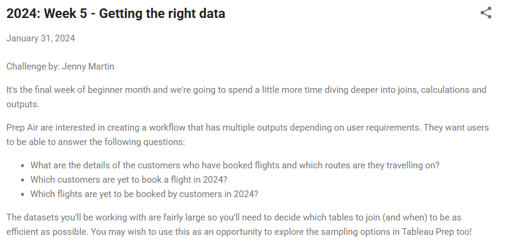
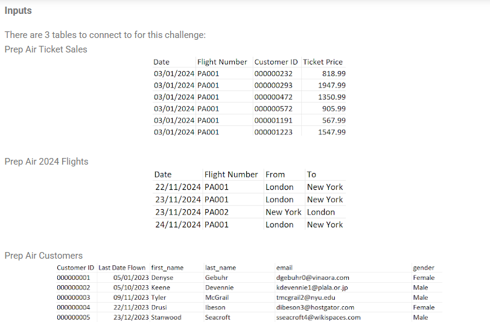

```python
import pandas as pd
from datetime import datetime
import numpy as np
```


```python
# read files
customers = pd.read_csv('./data/Prep Air Customers.csv')
flights = pd.read_csv('./data/Prep Air 2024 Flights.csv')
ticket_sales = pd.read_csv('./data/Prep Air Ticket Sales.csv')
```

### For the first output:
Create a dataset that gives all the customer details for booked flights in 2024. Make sure the output also includes details on the flights origin and destination
When outputting the data, create an excel file with a new sheet for each output (so 1 file for all outputs this week!)

  

**We will merge the three dataframes to produce this output:**  
- First, we will merge `flights` and `ticket_sales`.  
- Then, we will merge `customers` with the result of the previous merge."**  


```python
df = pd.merge(left=flights, right=ticket_sales, on=['Flight Number', 'Date'], how='inner')
```


```python
df = pd.merge(left=df, right=customers, on=['Customer ID'], how='inner')
```


```python
df.to_excel('output.xlsx', sheet_name='flights_details')
```

### For the second output:
- Create a dataset that allows Prep Air to identify which flights have not yet been booked in 2024
- Add a datestamp field to this dataset for today's date (31/01/2024) so that Prep Air know the unbooked flights as of the day the workflow is run
- When outputting the table to a new sheet in the Excel Workbook, choose the option "Append to Table" under Write Options. This means that if the workflow is run on a different day, the results will add additional rows to the dataset, rather than overwriting the previous run's data

- We need the data for the flights that are in the `flights` table but not in the `ticket_sales` table.


```python
data = pd.merge(left=flights, right=ticket_sales, how='left', on=['Flight Number', 'Date'], indicator=True)
unbooked_flights = data.query('_merge == "left_only"')
unbooked_flights = unbooked_flights.drop(['Customer ID', 'Ticket Price', '_merge'], axis=1)
unbooked_flights['Flight unbooked as of'] = '31/01/2024'
unbooked_flights
```


<div>
<style scoped>
    .dataframe tbody tr th:only-of-type {
        vertical-align: middle;
    }

    .dataframe tbody tr th {
        vertical-align: top;
    }

    .dataframe thead th {
        text-align: right;
    }
</style>
<table border="1" class="dataframe">
  <thead>
    <tr style="text-align: right;">
      <th></th>
      <th>Date</th>
      <th>Flight Number</th>
      <th>From</th>
      <th>To</th>
      <th>Flight unbooked as of</th>
    </tr>
  </thead>
  <tbody>
    <tr>
      <th>0</th>
      <td>2024-11-22</td>
      <td>PA001</td>
      <td>London</td>
      <td>New York</td>
      <td>31/01/2024</td>
    </tr>
    <tr>
      <th>1</th>
      <td>2024-11-23</td>
      <td>PA001</td>
      <td>London</td>
      <td>New York</td>
      <td>31/01/2024</td>
    </tr>
    <tr>
      <th>2</th>
      <td>2024-11-23</td>
      <td>PA002</td>
      <td>New York</td>
      <td>London</td>
      <td>31/01/2024</td>
    </tr>
    <tr>
      <th>3</th>
      <td>2024-11-24</td>
      <td>PA001</td>
      <td>London</td>
      <td>New York</td>
      <td>31/01/2024</td>
    </tr>
    <tr>
      <th>4</th>
      <td>2024-11-27</td>
      <td>PA001</td>
      <td>London</td>
      <td>New York</td>
      <td>31/01/2024</td>
    </tr>
    <tr>
      <th>...</th>
      <td>...</td>
      <td>...</td>
      <td>...</td>
      <td>...</td>
      <td>...</td>
    </tr>
    <tr>
      <th>291</th>
      <td>2024-12-27</td>
      <td>PA012</td>
      <td>Tokyo</td>
      <td>Perth</td>
      <td>31/01/2024</td>
    </tr>
    <tr>
      <th>292</th>
      <td>2024-12-28</td>
      <td>PA012</td>
      <td>Tokyo</td>
      <td>Perth</td>
      <td>31/01/2024</td>
    </tr>
    <tr>
      <th>293</th>
      <td>2024-12-29</td>
      <td>PA011</td>
      <td>Perth</td>
      <td>Tokyo</td>
      <td>31/01/2024</td>
    </tr>
    <tr>
      <th>294</th>
      <td>2024-12-30</td>
      <td>PA011</td>
      <td>Perth</td>
      <td>Tokyo</td>
      <td>31/01/2024</td>
    </tr>
    <tr>
      <th>295</th>
      <td>2024-12-31</td>
      <td>PA011</td>
      <td>Perth</td>
      <td>Tokyo</td>
      <td>31/01/2024</td>
    </tr>
  </tbody>
</table>
<p>296 rows × 5 columns</p>
</div>


```python
df.to_excel('output.xlsx', sheet_name='unbooked_flights')
```

#### For the third output:
- Create a dataset that shows which customers have yet to book a flight with Prep Air in 2024
- Create a field which will allow Prep Air to see how many days it has been since the customer last flew (compared to 31/01/2024)
- Categorise customers into the following groups:
    - Recent fliers - flown within the last 3 months
    - Taking a break - 3-6 months since last flight
    - Been away a while - 6-9 months since last flight
    - Lapsed Customers - over 9 months since last flight
- Output the data to a new sheet in the Excel Workbook
- We need the data for the customers that are in the `customers` table but not in the `ticket_sales` table.


```python
customers_yet_to_book = pd.merge(left=customers, right=ticket_sales, on=['Customer ID'], how='left', indicator=True)\
.query('_merge == "left_only"')
```


```python
customers_yet_to_book = customers_yet_to_book.drop(['Date', 'Flight Number', 'Ticket Price', '_merge'], axis=1)
```


```python
customers_yet_to_book['Last Date Flown'] = pd.to_datetime(customers_yet_to_book['Last Date Flown'])
today_date = datetime.strptime('31/01/2024', '%d/%m/%Y')
customers_yet_to_book['Days Since Last Flown'] = (today_date - customers_yet_to_book['Last Date Flown']).dt.days

customers_yet_to_book
```


<div>
<style scoped>
    .dataframe tbody tr th:only-of-type {
        vertical-align: middle;
    }

    .dataframe tbody tr th {
        vertical-align: top;
    }

    .dataframe thead th {
        text-align: right;
    }
</style>
<table border="1" class="dataframe">
  <thead>
    <tr style="text-align: right;">
      <th></th>
      <th>Customer ID</th>
      <th>Last Date Flown</th>
      <th>first_name</th>
      <th>last_name</th>
      <th>email</th>
      <th>gender</th>
      <th>Days Since Last Flown</th>
    </tr>
  </thead>
  <tbody>
    <tr>
      <th>11</th>
      <td>3</td>
      <td>2023-11-09</td>
      <td>Tyler</td>
      <td>McGrail</td>
      <td>tmcgrail2@nyu.edu</td>
      <td>Male</td>
      <td>83</td>
    </tr>
    <tr>
      <th>40</th>
      <td>9</td>
      <td>2023-06-05</td>
      <td>Binnie</td>
      <td>Jeckell</td>
      <td>bjeckell8@123-reg.co.uk</td>
      <td>Female</td>
      <td>240</td>
    </tr>
    <tr>
      <th>56</th>
      <td>14</td>
      <td>2023-05-02</td>
      <td>Ashil</td>
      <td>Tetlow</td>
      <td>atetlowd@woothemes.com</td>
      <td>Female</td>
      <td>274</td>
    </tr>
    <tr>
      <th>57</th>
      <td>15</td>
      <td>2023-05-18</td>
      <td>Ayn</td>
      <td>Bengtson</td>
      <td>abengtsone@bloomberg.com</td>
      <td>Female</td>
      <td>258</td>
    </tr>
    <tr>
      <th>100</th>
      <td>24</td>
      <td>2023-02-15</td>
      <td>Grace</td>
      <td>Piesing</td>
      <td>gpiesingn@zdnet.com</td>
      <td>Female</td>
      <td>350</td>
    </tr>
    <tr>
      <th>...</th>
      <td>...</td>
      <td>...</td>
      <td>...</td>
      <td>...</td>
      <td>...</td>
      <td>...</td>
      <td>...</td>
    </tr>
    <tr>
      <th>45908</th>
      <td>9972</td>
      <td>2023-10-14</td>
      <td>Any</td>
      <td>Mongeot</td>
      <td>amongeotqz@twitter.com</td>
      <td>Male</td>
      <td>109</td>
    </tr>
    <tr>
      <th>45917</th>
      <td>9975</td>
      <td>2023-03-04</td>
      <td>Idell</td>
      <td>Clyant</td>
      <td>iclyantr2@hostgator.com</td>
      <td>Female</td>
      <td>333</td>
    </tr>
    <tr>
      <th>45927</th>
      <td>9978</td>
      <td>2023-04-21</td>
      <td>Spike</td>
      <td>Thaller</td>
      <td>sthallerr5@gov.uk</td>
      <td>Agender</td>
      <td>285</td>
    </tr>
    <tr>
      <th>45989</th>
      <td>9989</td>
      <td>2023-11-06</td>
      <td>Robbie</td>
      <td>Grugerr</td>
      <td>rgrugerrrg@plala.or.jp</td>
      <td>Female</td>
      <td>86</td>
    </tr>
    <tr>
      <th>46020</th>
      <td>9996</td>
      <td>2023-09-16</td>
      <td>Jelene</td>
      <td>Dodgshun</td>
      <td>jdodgshunrn@angelfire.com</td>
      <td>Female</td>
      <td>137</td>
    </tr>
  </tbody>
</table>
<p>1260 rows × 7 columns</p>
</div>


```python
months_since_last_flown = customers_yet_to_book['Days Since Last Flown']//30
```


```python
customers_categories = [0, 3, 6, 9,  float('inf')]
labels = ['Recent fliers', 'Taking a break', 'Been away a while', 'Lapsed Customers']
customers_yet_to_book['Customer Category'] = pd.cut(months_since_last_flown, 
                                                   bins=customers_categories, labels=labels,
                                                   right=False)
```


```python
customers_yet_to_book.to_excel('output.xlsx', sheet_name='customers_yet_to_book')
```
