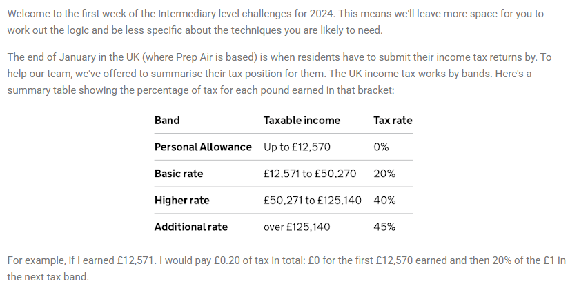
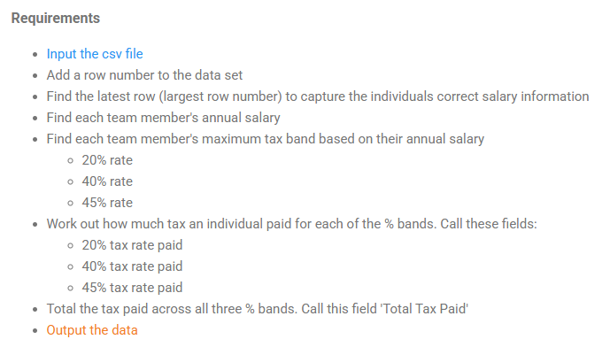

## 2024 Week 6 - Staff Income Tax





```python
import pandas as pd
import numpy as np
```


```python
df = pd.read_csv('PD 2024 Wk 6 Input.csv')
df.head()
```


<div>
<style scoped>
    .dataframe tbody tr th:only-of-type {
        vertical-align: middle;
    }

    .dataframe tbody tr th {
        vertical-align: top;
    }

    .dataframe thead th {
        text-align: right;
    }
</style>
<table border="1" class="dataframe">
  <thead>
    <tr style="text-align: right;">
      <th></th>
      <th>StaffID</th>
      <th>1</th>
      <th>2</th>
      <th>3</th>
      <th>4</th>
      <th>5</th>
      <th>6</th>
      <th>7</th>
      <th>8</th>
      <th>9</th>
      <th>10</th>
      <th>11</th>
      <th>12</th>
    </tr>
  </thead>
  <tbody>
    <tr>
      <th>0</th>
      <td>1533</td>
      <td>2398.0</td>
      <td>2421.98</td>
      <td>2446.20</td>
      <td>2446.20</td>
      <td>2495.12</td>
      <td>2495.12</td>
      <td>2495.12</td>
      <td>2495.12</td>
      <td>2545.03</td>
      <td>2621.38</td>
      <td>2621.38</td>
      <td>2621.38</td>
    </tr>
    <tr>
      <th>1</th>
      <td>1339</td>
      <td>7304.0</td>
      <td>7523.12</td>
      <td>7673.58</td>
      <td>7673.58</td>
      <td>7750.32</td>
      <td>7827.82</td>
      <td>8062.66</td>
      <td>8304.54</td>
      <td>8470.63</td>
      <td>8555.33</td>
      <td>8555.33</td>
      <td>8726.44</td>
    </tr>
    <tr>
      <th>2</th>
      <td>2291</td>
      <td>8240.0</td>
      <td>8404.80</td>
      <td>8572.90</td>
      <td>8744.35</td>
      <td>8831.80</td>
      <td>9096.75</td>
      <td>9278.69</td>
      <td>9464.26</td>
      <td>9464.26</td>
      <td>9464.26</td>
      <td>9558.90</td>
      <td>9558.90</td>
    </tr>
    <tr>
      <th>3</th>
      <td>2038</td>
      <td>3908.0</td>
      <td>3986.16</td>
      <td>3986.16</td>
      <td>4026.02</td>
      <td>4066.28</td>
      <td>4188.27</td>
      <td>4313.92</td>
      <td>4443.34</td>
      <td>4487.77</td>
      <td>4622.40</td>
      <td>4668.63</td>
      <td>4715.31</td>
    </tr>
    <tr>
      <th>4</th>
      <td>2810</td>
      <td>3988.0</td>
      <td>4107.64</td>
      <td>4148.72</td>
      <td>4190.20</td>
      <td>4274.01</td>
      <td>4316.75</td>
      <td>4316.75</td>
      <td>4359.92</td>
      <td>4490.71</td>
      <td>4535.62</td>
      <td>4671.69</td>
      <td>4718.41</td>
    </tr>
  </tbody>
</table>
</div>


```python
df.duplicated(subset=['StaffID']).sum()
# That's way we are going to capture the individuals' latest row to get the correct salary information.
# salaries of the last 12 month
```


    196


#### Add a row number to the data set
#### Find the latest row (largest row number) to capture the individuals correct salary information


```python
df['RowNumber'] = range(df.shape[0])
```


```python
latest_salaries =  df.loc[df.groupby('StaffID')['RowNumber'].idxmax()]
```

#### Find each team member's annual salary


```python
latest_salaries['Salary'] = latest_salaries.iloc[:, 1:-1].sum(axis=1)
```


```python
latest_salaries[latest_salaries['StaffID']==1052]
df = latest_salaries[['StaffID', 'Salary']]
```


```python
bins = [0, 12570, 50270, 125140, float('inf')]
labels = ['0% rate', '20% rate', '40% rate', '45% rate']
```


```python
df.loc[:, ['Max Tax Rate']] = pd.cut(df.Salary, bins, labels=labels, right=True)
df
```


<div>
<style scoped>
    .dataframe tbody tr th:only-of-type {
        vertical-align: middle;
    }

    .dataframe tbody tr th {
        vertical-align: top;
    }

    .dataframe thead th {
        text-align: right;
    }
</style>
<table border="1" class="dataframe">
  <thead>
    <tr style="text-align: right;">
      <th></th>
      <th>StaffID</th>
      <th>Salary</th>
      <th>Max Tax Rate</th>
    </tr>
  </thead>
  <tbody>
    <tr>
      <th>386</th>
      <td>1000</td>
      <td>173197.95</td>
      <td>45% rate</td>
    </tr>
    <tr>
      <th>5</th>
      <td>1001</td>
      <td>166864.48</td>
      <td>45% rate</td>
    </tr>
    <tr>
      <th>877</th>
      <td>1007</td>
      <td>27969.52</td>
      <td>20% rate</td>
    </tr>
    <tr>
      <th>262</th>
      <td>1010</td>
      <td>111033.29</td>
      <td>40% rate</td>
    </tr>
    <tr>
      <th>96</th>
      <td>1012</td>
      <td>115739.53</td>
      <td>40% rate</td>
    </tr>
    <tr>
      <th>...</th>
      <td>...</td>
      <td>...</td>
      <td>...</td>
    </tr>
    <tr>
      <th>515</th>
      <td>2994</td>
      <td>111712.65</td>
      <td>40% rate</td>
    </tr>
    <tr>
      <th>322</th>
      <td>2995</td>
      <td>134668.02</td>
      <td>45% rate</td>
    </tr>
    <tr>
      <th>842</th>
      <td>2997</td>
      <td>32379.93</td>
      <td>20% rate</td>
    </tr>
    <tr>
      <th>565</th>
      <td>2998</td>
      <td>24647.13</td>
      <td>20% rate</td>
    </tr>
    <tr>
      <th>947</th>
      <td>2999</td>
      <td>85976.30</td>
      <td>40% rate</td>
    </tr>
  </tbody>
</table>
<p>803 rows × 3 columns</p>
</div>


```python
# Define tax band limits and personal allowance (2023/2024 UK tax rates)
personal_allowance = 12570  # Income up to £12,570 is tax-free
basic_rate_limit = 50270    # Basic rate applies to income between £12,571 and £50,270
higher_rate_limit = 125140  # Higher rate applies to income between £50,271 and £125,140

# Function to calculate tax paid at the 20% rate
def cal_rate_20_tax(salary):
    """
    Calculate the tax paid at the 20% rate (basic rate).
    Args:
        salary (float): The individual's annual income.
    Returns:
        float: The tax paid at the 20% rate, or NaN if the income is not taxable.
    """
    # Calculate taxable income by subtracting the personal allowance
    taxable_income = max(salary - personal_allowance, 0)
    
    # Calculate income in the basic rate band
    # The basic rate applies to income between £12,571 and £50,270
    basic_rate_income = min(taxable_income, basic_rate_limit - personal_allowance)
    
    # Calculate tax at the 20% rate
    return basic_rate_income * 0.2

# Function to calculate tax paid at the 40% rate
def cal_rate_40_tax(salary):
    """
    Calculate the tax paid at the 40% rate (higher rate).
    Args:
        salary (float): The individual's annual income.
    Returns:
        float: The tax paid at the 40% rate, or NaN if the income is not taxable.
    """
    # Calculate taxable income by subtracting the personal allowance
    taxable_income = max(salary - personal_allowance, 0)
    
    # Calculate income in the higher rate band
    # The higher rate applies to income between £50,271 and £125,140
    higher_rate_income = min(
        max(taxable_income - (basic_rate_limit - personal_allowance), 0),
        higher_rate_limit - basic_rate_limit
    )
    
    # Calculate tax at the 40% rate
    return higher_rate_income * 0.4

# Function to calculate tax paid at the 45% rate
def cal_rate_45_tax(salary):
    """
    Calculate the tax paid at the 45% rate (additional rate).
    Args:
        salary (float): The individual's annual income.
    Returns:
        float: The tax paid at the 45% rate, or NaN if the income is not taxable.
    """

    # Calculate taxable income by subtracting the personal allowance
    taxable_income = max(salary - personal_allowance, 0)
    
    # Calculate income in the additional rate band
    # The additional rate applies to income above £125,140
    additional_rate_income = max(taxable_income - (higher_rate_limit - personal_allowance), 0)
    
    # Calculate tax at the 45% rate
    return additional_rate_income * 0.45

```


```python
df.loc[:, ['20% rate tax paid']] = df.Salary.apply(cal_rate_20_tax)
df.loc[:, ['40% rate tax paid']] = df.Salary.apply(cal_rate_40_tax)
df.loc[:, ['45% rate tax paid']] = df.Salary.apply(cal_rate_45_tax)
```


```python
df.loc[:, ['Total Tax Paid']] = df['20% rate tax paid'] + df['40% rate tax paid'] + df['45% rate tax paid']
```


```python
df.head()
```


<div>
<style scoped>
    .dataframe tbody tr th:only-of-type {
        vertical-align: middle;
    }

    .dataframe tbody tr th {
        vertical-align: top;
    }

    .dataframe thead th {
        text-align: right;
    }
</style>
<table border="1" class="dataframe">
  <thead>
    <tr style="text-align: right;">
      <th></th>
      <th>Salary</th>
      <th>Max Tax Rate</th>
      <th>20% rate tax paid</th>
      <th>40% rate tax paid</th>
      <th>45% rate tax paid</th>
      <th>Total Tax Paid</th>
    </tr>
    <tr>
      <th>StaffID</th>
      <th></th>
      <th></th>
      <th></th>
      <th></th>
      <th></th>
      <th></th>
    </tr>
  </thead>
  <tbody>
    <tr>
      <th>1000</th>
      <td>173197.95</td>
      <td>45% rate</td>
      <td>7540.000</td>
      <td>29948.000</td>
      <td>21626.0775</td>
      <td>59114.0775</td>
    </tr>
    <tr>
      <th>1001</th>
      <td>166864.48</td>
      <td>45% rate</td>
      <td>7540.000</td>
      <td>29948.000</td>
      <td>18776.0160</td>
      <td>56264.0160</td>
    </tr>
    <tr>
      <th>1007</th>
      <td>27969.52</td>
      <td>20% rate</td>
      <td>3079.904</td>
      <td>0.000</td>
      <td>0.0000</td>
      <td>3079.9040</td>
    </tr>
    <tr>
      <th>1010</th>
      <td>111033.29</td>
      <td>40% rate</td>
      <td>7540.000</td>
      <td>24305.316</td>
      <td>0.0000</td>
      <td>31845.3160</td>
    </tr>
    <tr>
      <th>1012</th>
      <td>115739.53</td>
      <td>40% rate</td>
      <td>7540.000</td>
      <td>26187.812</td>
      <td>0.0000</td>
      <td>33727.8120</td>
    </tr>
  </tbody>
</table>
</div>


