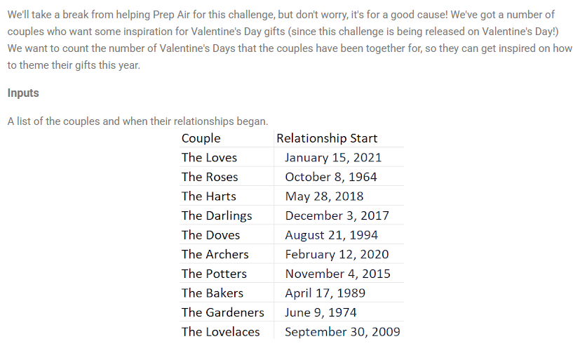
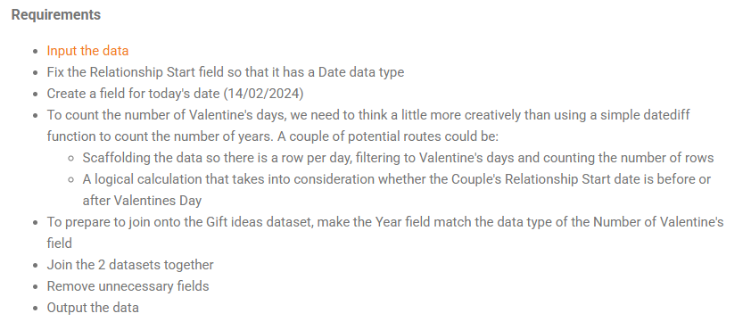

## 2024 Week 7 - Valentine's Day





```python
import pandas as pd
from datetime import datetime
```


```python
df = pd.read_excel("Valentine's Preppin' Data.xlsx", sheet_name=None)
```


```python
couples = df['Couples']
gifts = df['Gifts']
```


```python
couples.info()
```

    <class 'pandas.core.frame.DataFrame'>
    RangeIndex: 10 entries, 0 to 9
    Data columns (total 2 columns):
     #   Column              Non-Null Count  Dtype 
    ---  ------              --------------  ----- 
     0   Couple              10 non-null     object
     1   Relationship Start  10 non-null     object
    dtypes: object(2)
    memory usage: 292.0+ bytes
    


```python
gifts.info()
```

    <class 'pandas.core.frame.DataFrame'>
    RangeIndex: 20 entries, 0 to 19
    Data columns (total 2 columns):
     #   Column  Non-Null Count  Dtype 
    ---  ------  --------------  ----- 
     0   Year    20 non-null     object
     1   Gift    20 non-null     object
    dtypes: object(2)
    memory usage: 452.0+ bytes
    

#### Fix the Relationship Start field so that it has a Date data type


```python
couples['Relationship Start'] = pd.to_datetime(couples['Relationship Start'])
couples['Relationship Start'].head()
```


    0   2021-01-15
    1   1964-10-08
    2   2018-05-28
    3   2017-12-03
    4   1994-08-21
    Name: Relationship Start, dtype: datetime64[ns]


#### Create a field for today's date (14/02/2024)
#### To count the number of Valentine's days, we need to think a little more creatively than using a simple datediff function to count the number of years. A couple of potential routes could be:
- Scaffolding the data so there is a row per day, filtering to Valentine's days and counting the number of rows
- A logical calculation that takes into consideration whether the Couple's Relationship Start date is before or after Valentines Day


```python
today_date = datetime.strptime('14/02/2024', '%d/%m/%Y')

def count_valentine_days(date):
    date_ranges = pd.Series(pd.date_range(start=date, end=today_date))
    dates = pd.DataFrame({'month': date_ranges.dt.month,
             'day': date_ranges.dt.day})
    valentine_days = dates.query('month==2 and day==14')
    return valentine_days.count().iloc[0]
```


```python
couples["Number of Valentine's Days as a Couple"] = couples['Relationship Start'].apply(count_valentine_days)
```


```python
gifts.Year = gifts.Year.str.extract(r'(\d+)').astype(int)
```


```python
df = pd.merge(left=couples, right=gifts, 
         left_on="Number of Valentine's Days as a Couple", 
         right_on='Year',
         how = 'inner')
df.drop(['Relationship Start', 'Year'], axis=1, inplace=True)
```


```python
df.sort_values("Number of Valentine's Days as a Couple", inplace=True)
df
```


<div>
<style scoped>
    .dataframe tbody tr th:only-of-type {
        vertical-align: middle;
    }

    .dataframe tbody tr th {
        vertical-align: top;
    }

    .dataframe thead th {
        text-align: right;
    }
</style>
<table border="1" class="dataframe">
  <thead>
    <tr style="text-align: right;">
      <th></th>
      <th>Couple</th>
      <th>Number of Valentine's Days as a Couple</th>
      <th>Gift</th>
    </tr>
  </thead>
  <tbody>
    <tr>
      <th>0</th>
      <td>The Loves</td>
      <td>4</td>
      <td>Fruit/Flowers</td>
    </tr>
    <tr>
      <th>5</th>
      <td>The Archers</td>
      <td>5</td>
      <td>Wood</td>
    </tr>
    <tr>
      <th>2</th>
      <td>The Harts</td>
      <td>6</td>
      <td>Iron</td>
    </tr>
    <tr>
      <th>3</th>
      <td>The Darlings</td>
      <td>7</td>
      <td>Copper/Wool</td>
    </tr>
    <tr>
      <th>6</th>
      <td>The Potters</td>
      <td>9</td>
      <td>Pottery</td>
    </tr>
    <tr>
      <th>9</th>
      <td>The Lovelaces</td>
      <td>15</td>
      <td>Crystal</td>
    </tr>
    <tr>
      <th>4</th>
      <td>The Doves</td>
      <td>30</td>
      <td>Pearl</td>
    </tr>
    <tr>
      <th>7</th>
      <td>The Bakers</td>
      <td>35</td>
      <td>Coral</td>
    </tr>
    <tr>
      <th>8</th>
      <td>The Gardeners</td>
      <td>50</td>
      <td>Gold</td>
    </tr>
    <tr>
      <th>1</th>
      <td>The Roses</td>
      <td>60</td>
      <td>Diamond</td>
    </tr>
  </tbody>
</table>
</div>


