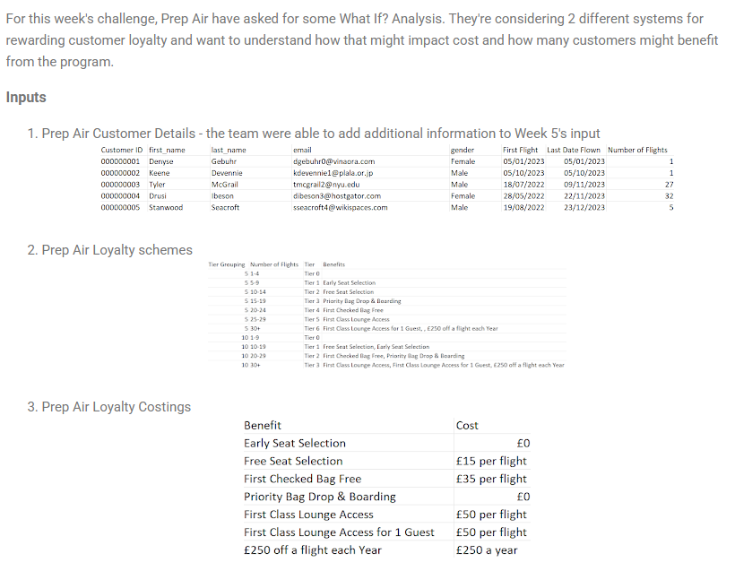
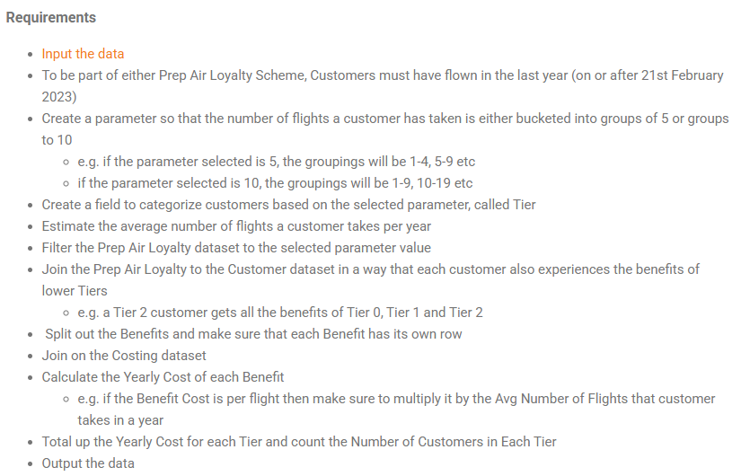

## 2024 Week 8 - Prep Air Loyalty




```python
import pandas as pd
import numpy as np
```


```python
loyalty = pd.read_excel('./data/Prep Air Loyalty.xlsx', sheet_name=None)
customers = pd.read_csv('./data/Prep Air Updated Customers.csv')
```


```python
customers_loyalty = loyalty['Prep Air Loyalty']
loyalty_costings = loyalty['Costings']
```


```python
customers.head()
```


<div>
<style scoped>
    .dataframe tbody tr th:only-of-type {
        vertical-align: middle;
    }

    .dataframe tbody tr th {
        vertical-align: top;
    }

    .dataframe thead th {
        text-align: right;
    }
</style>
<table border="1" class="dataframe">
  <thead>
    <tr style="text-align: right;">
      <th></th>
      <th>Customer ID</th>
      <th>first_name</th>
      <th>last_name</th>
      <th>email</th>
      <th>gender</th>
      <th>First Flight</th>
      <th>Last Date Flown</th>
      <th>Number of Flights</th>
    </tr>
  </thead>
  <tbody>
    <tr>
      <th>0</th>
      <td>1</td>
      <td>Denyse</td>
      <td>Gebuhr</td>
      <td>dgebuhr0@vinaora.com</td>
      <td>Female</td>
      <td>2023-01-05</td>
      <td>2023-01-05</td>
      <td>1</td>
    </tr>
    <tr>
      <th>1</th>
      <td>2</td>
      <td>Keene</td>
      <td>Devennie</td>
      <td>kdevennie1@plala.or.jp</td>
      <td>Male</td>
      <td>2023-10-05</td>
      <td>2023-10-05</td>
      <td>1</td>
    </tr>
    <tr>
      <th>2</th>
      <td>3</td>
      <td>Tyler</td>
      <td>McGrail</td>
      <td>tmcgrail2@nyu.edu</td>
      <td>Male</td>
      <td>2022-07-18</td>
      <td>2023-11-09</td>
      <td>27</td>
    </tr>
    <tr>
      <th>3</th>
      <td>4</td>
      <td>Drusi</td>
      <td>Ibeson</td>
      <td>dibeson3@hostgator.com</td>
      <td>Female</td>
      <td>2022-05-28</td>
      <td>2023-11-22</td>
      <td>32</td>
    </tr>
    <tr>
      <th>4</th>
      <td>5</td>
      <td>Stanwood</td>
      <td>Seacroft</td>
      <td>sseacroft4@wikispaces.com</td>
      <td>Male</td>
      <td>2022-08-19</td>
      <td>2023-12-23</td>
      <td>5</td>
    </tr>
  </tbody>
</table>
</div>


```python
customers_loyalty
```


<div>
<style scoped>
    .dataframe tbody tr th:only-of-type {
        vertical-align: middle;
    }

    .dataframe tbody tr th {
        vertical-align: top;
    }

    .dataframe thead th {
        text-align: right;
    }
</style>
<table border="1" class="dataframe">
  <thead>
    <tr style="text-align: right;">
      <th></th>
      <th>Tier Grouping</th>
      <th>Number of Flights</th>
      <th>Tier</th>
      <th>Benefits</th>
    </tr>
  </thead>
  <tbody>
    <tr>
      <th>0</th>
      <td>5</td>
      <td>1-4</td>
      <td>Tier 0</td>
      <td>NaN</td>
    </tr>
    <tr>
      <th>1</th>
      <td>5</td>
      <td>5-9</td>
      <td>Tier 1</td>
      <td>Early Seat Selection</td>
    </tr>
    <tr>
      <th>2</th>
      <td>5</td>
      <td>10-14</td>
      <td>Tier 2</td>
      <td>Free Seat Selection</td>
    </tr>
    <tr>
      <th>3</th>
      <td>5</td>
      <td>15-19</td>
      <td>Tier 3</td>
      <td>Priority Bag Drop &amp; Boarding</td>
    </tr>
    <tr>
      <th>4</th>
      <td>5</td>
      <td>20-24</td>
      <td>Tier 4</td>
      <td>First Checked Bag Free</td>
    </tr>
    <tr>
      <th>5</th>
      <td>5</td>
      <td>25-29</td>
      <td>Tier 5</td>
      <td>First Class Lounge Access</td>
    </tr>
    <tr>
      <th>6</th>
      <td>5</td>
      <td>30+</td>
      <td>Tier 6</td>
      <td>First Class Lounge Access for 1 Guest, , £250 ...</td>
    </tr>
    <tr>
      <th>7</th>
      <td>10</td>
      <td>1-9</td>
      <td>Tier 0</td>
      <td>NaN</td>
    </tr>
    <tr>
      <th>8</th>
      <td>10</td>
      <td>10-19</td>
      <td>Tier 1</td>
      <td>Free Seat Selection, Early Seat Selection</td>
    </tr>
    <tr>
      <th>9</th>
      <td>10</td>
      <td>20-29</td>
      <td>Tier 2</td>
      <td>First Checked Bag Free, Priority Bag Drop &amp; Bo...</td>
    </tr>
    <tr>
      <th>10</th>
      <td>10</td>
      <td>30+</td>
      <td>Tier 3</td>
      <td>First Class Lounge Access, First Class Lounge ...</td>
    </tr>
  </tbody>
</table>
</div>


```python
loyalty_costings
```


<div>
<style scoped>
    .dataframe tbody tr th:only-of-type {
        vertical-align: middle;
    }

    .dataframe tbody tr th {
        vertical-align: top;
    }

    .dataframe thead th {
        text-align: right;
    }
</style>
<table border="1" class="dataframe">
  <thead>
    <tr style="text-align: right;">
      <th></th>
      <th>Benefit</th>
      <th>Cost</th>
    </tr>
  </thead>
  <tbody>
    <tr>
      <th>0</th>
      <td>Early Seat Selection</td>
      <td>0</td>
    </tr>
    <tr>
      <th>1</th>
      <td>Free Seat Selection</td>
      <td>£15 per flight</td>
    </tr>
    <tr>
      <th>2</th>
      <td>First Checked Bag Free</td>
      <td>£35 per flight</td>
    </tr>
    <tr>
      <th>3</th>
      <td>Priority Bag Drop &amp; Boarding</td>
      <td>0</td>
    </tr>
    <tr>
      <th>4</th>
      <td>First Class Lounge Access</td>
      <td>£50 per flight</td>
    </tr>
    <tr>
      <th>5</th>
      <td>First Class Lounge Access for 1 Guest</td>
      <td>£50 per flight</td>
    </tr>
    <tr>
      <th>6</th>
      <td>£250 off a flight each Year</td>
      <td>£250 a year</td>
    </tr>
  </tbody>
</table>
</div>


##### To be part of either Prep Air Loyalty Scheme, Customers must have flown in the last year (on or after 21st February 2023)


```python
customers['First Flight'] = pd.to_datetime(customers['First Flight'])
customers['Last Date Flown'] = pd.to_datetime(customers['Last Date Flown'])
```


```python
loyal_customers = customers[customers['Last Date Flown'] >= '2023-02-21'].copy()
```

#### Create a parameter so that the number of flights a customer has taken is either bucketed into groups of 5 or groups to 10
- e.g. if the parameter selected is 5, the groupings will be 1-4, 5-9 etc
- if the parameter selected is 10, the groupings will be 1-9, 10-19 etc
#### Create a field to categorize customers based on the selected parameter, called Tier


```python
loyal_customers['Number of Flights'].describe()
```


    count    8853.000000
    mean       14.440642
    std         9.987883
    min         1.000000
    25%         5.000000
    50%        14.000000
    75%        23.000000
    max        32.000000
    Name: Number of Flights, dtype: float64


```python
customers_loyalty['Number of Flights'].unique()
```


    array(['1-4', '5-9', '10-14', '15-19', '20-24', '25-29', '30+', '1-9',
           '10-19', '20-29'], dtype=object)


```python
bins = [1, 5, 10, 15, 20, 25, 30, float('inf')]
Tiers = np.arange(0, 7)
loyal_customers['Tier'] = pd.cut(loyal_customers['Number of Flights'], bins, labels=Tiers, include_lowest=True, right=False)
loyal_customers['Tier'].value_counts()
```


    Tier
    0    2089
    1    1238
    5    1238
    3    1220
    2    1217
    4    1170
    6     681
    Name: count, dtype: int64


#### Estimate the average number of flights a customer takes per year 


```python
# calculating the number of years they have been a customer
customers_years = ((loyal_customers['Last Date Flown'].dt.year - loyal_customers['First Flight'].dt.year) + 1)

loyal_customers['Avg Flights per Year'] = (loyal_customers['Number of Flights'] / customers_years).round(2)
loyal_customers = loyal_customers[loyal_customers['Avg Flights per Year'] != float('inf')]
loyal_customers.drop(['first_name',	'last_name', 'email', 'gender'], axis=1, inplace=True)

```


```python
loyal_customers.head(10)
```


<div>
<style scoped>
    .dataframe tbody tr th:only-of-type {
        vertical-align: middle;
    }

    .dataframe tbody tr th {
        vertical-align: top;
    }

    .dataframe thead th {
        text-align: right;
    }
</style>
<table border="1" class="dataframe">
  <thead>
    <tr style="text-align: right;">
      <th></th>
      <th>Customer ID</th>
      <th>First Flight</th>
      <th>Last Date Flown</th>
      <th>Number of Flights</th>
      <th>Tier</th>
      <th>Avg Flights per Year</th>
    </tr>
  </thead>
  <tbody>
    <tr>
      <th>1</th>
      <td>2</td>
      <td>2023-10-05</td>
      <td>2023-10-05</td>
      <td>1</td>
      <td>0</td>
      <td>1.0</td>
    </tr>
    <tr>
      <th>2</th>
      <td>3</td>
      <td>2022-07-18</td>
      <td>2023-11-09</td>
      <td>27</td>
      <td>5</td>
      <td>13.5</td>
    </tr>
    <tr>
      <th>3</th>
      <td>4</td>
      <td>2022-05-28</td>
      <td>2023-11-22</td>
      <td>32</td>
      <td>6</td>
      <td>16.0</td>
    </tr>
    <tr>
      <th>4</th>
      <td>5</td>
      <td>2022-08-19</td>
      <td>2023-12-23</td>
      <td>5</td>
      <td>1</td>
      <td>2.5</td>
    </tr>
    <tr>
      <th>5</th>
      <td>6</td>
      <td>2023-02-28</td>
      <td>2023-02-28</td>
      <td>1</td>
      <td>0</td>
      <td>1.0</td>
    </tr>
    <tr>
      <th>7</th>
      <td>8</td>
      <td>2022-12-27</td>
      <td>2023-07-02</td>
      <td>9</td>
      <td>1</td>
      <td>4.5</td>
    </tr>
    <tr>
      <th>8</th>
      <td>9</td>
      <td>2023-06-05</td>
      <td>2023-06-05</td>
      <td>1</td>
      <td>0</td>
      <td>1.0</td>
    </tr>
    <tr>
      <th>9</th>
      <td>10</td>
      <td>2023-06-14</td>
      <td>2023-09-01</td>
      <td>2</td>
      <td>0</td>
      <td>2.0</td>
    </tr>
    <tr>
      <th>10</th>
      <td>11</td>
      <td>2022-09-03</td>
      <td>2023-08-23</td>
      <td>24</td>
      <td>4</td>
      <td>12.0</td>
    </tr>
    <tr>
      <th>11</th>
      <td>12</td>
      <td>2023-07-20</td>
      <td>2023-09-11</td>
      <td>16</td>
      <td>3</td>
      <td>16.0</td>
    </tr>
  </tbody>
</table>
</div>


```python
loyal_customers[loyal_customers['Customer ID']==8]
```


<div>
<style scoped>
    .dataframe tbody tr th:only-of-type {
        vertical-align: middle;
    }

    .dataframe tbody tr th {
        vertical-align: top;
    }

    .dataframe thead th {
        text-align: right;
    }
</style>
<table border="1" class="dataframe">
  <thead>
    <tr style="text-align: right;">
      <th></th>
      <th>Customer ID</th>
      <th>First Flight</th>
      <th>Last Date Flown</th>
      <th>Number of Flights</th>
      <th>Tier</th>
      <th>Avg Flights per Year</th>
    </tr>
  </thead>
  <tbody>
    <tr>
      <th>7</th>
      <td>8</td>
      <td>2022-12-27</td>
      <td>2023-07-02</td>
      <td>9</td>
      <td>1</td>
      <td>4.5</td>
    </tr>
  </tbody>
</table>
</div>


#### Filter the Prep Air Loyalty dataset to the selected parameter value
We select the parameter value to be 5


```python
customers_loyalty = customers_loyalty[customers_loyalty['Tier Grouping'] == 5].copy()

```


```python
customers_loyalty.Tier = customers_loyalty.Tier.str.extract(r'(\d+)')
customers_loyalty.Tier = customers_loyalty.Tier.astype(np.int32)

loyal_customers.Tier = loyal_customers.Tier.astype(np.int32)
```

#### Join the Prep Air Loyalty to the Customer dataset in a way that each customer also experiences the benefits of lower Tiers
e.g. a Tier 2 customer gets all the benefits of Tier 0, Tier 1 and Tier 2 


```python
# cross join
df = loyal_customers.assign(key=1).merge(customers_loyalty.assign(key=1), on='key').drop('key', axis=1)

# Get the data where the Tier from the Customers table is >= Tier from the Loyalty table. 
df = df.query("Tier_x >= Tier_y")
df[df['Customer ID']==3]
```


<div>
<style scoped>
    .dataframe tbody tr th:only-of-type {
        vertical-align: middle;
    }

    .dataframe tbody tr th {
        vertical-align: top;
    }

    .dataframe thead th {
        text-align: right;
    }
</style>
<table border="1" class="dataframe">
  <thead>
    <tr style="text-align: right;">
      <th></th>
      <th>Customer ID</th>
      <th>First Flight</th>
      <th>Last Date Flown</th>
      <th>Number of Flights_x</th>
      <th>Tier_x</th>
      <th>Avg Flights per Year</th>
      <th>Tier Grouping</th>
      <th>Number of Flights_y</th>
      <th>Tier_y</th>
      <th>Benefits</th>
    </tr>
  </thead>
  <tbody>
    <tr>
      <th>7</th>
      <td>3</td>
      <td>2022-07-18</td>
      <td>2023-11-09</td>
      <td>27</td>
      <td>5</td>
      <td>13.5</td>
      <td>5</td>
      <td>1-4</td>
      <td>0</td>
      <td>NaN</td>
    </tr>
    <tr>
      <th>8</th>
      <td>3</td>
      <td>2022-07-18</td>
      <td>2023-11-09</td>
      <td>27</td>
      <td>5</td>
      <td>13.5</td>
      <td>5</td>
      <td>5-9</td>
      <td>1</td>
      <td>Early Seat Selection</td>
    </tr>
    <tr>
      <th>9</th>
      <td>3</td>
      <td>2022-07-18</td>
      <td>2023-11-09</td>
      <td>27</td>
      <td>5</td>
      <td>13.5</td>
      <td>5</td>
      <td>10-14</td>
      <td>2</td>
      <td>Free Seat Selection</td>
    </tr>
    <tr>
      <th>10</th>
      <td>3</td>
      <td>2022-07-18</td>
      <td>2023-11-09</td>
      <td>27</td>
      <td>5</td>
      <td>13.5</td>
      <td>5</td>
      <td>15-19</td>
      <td>3</td>
      <td>Priority Bag Drop &amp; Boarding</td>
    </tr>
    <tr>
      <th>11</th>
      <td>3</td>
      <td>2022-07-18</td>
      <td>2023-11-09</td>
      <td>27</td>
      <td>5</td>
      <td>13.5</td>
      <td>5</td>
      <td>20-24</td>
      <td>4</td>
      <td>First Checked Bag Free</td>
    </tr>
    <tr>
      <th>12</th>
      <td>3</td>
      <td>2022-07-18</td>
      <td>2023-11-09</td>
      <td>27</td>
      <td>5</td>
      <td>13.5</td>
      <td>5</td>
      <td>25-29</td>
      <td>5</td>
      <td>First Class Lounge Access</td>
    </tr>
  </tbody>
</table>
</div>


```python
df.columns
```


    Index(['Customer ID', 'First Flight', 'Last Date Flown', 'Number of Flights_x',
           'Tier_x', 'Avg Flights per Year', 'Tier Grouping',
           'Number of Flights_y', 'Tier_y', 'Benefits'],
          dtype='object')


```python
cols = ['Tier_x', 'Benefits', 'Avg Flights per Year', 'Customer ID', 'First Flight', 'Last Date Flown', 'Number of Flights_y']
df = df[cols]
df.head()
```


<div>
<style scoped>
    .dataframe tbody tr th:only-of-type {
        vertical-align: middle;
    }

    .dataframe tbody tr th {
        vertical-align: top;
    }

    .dataframe thead th {
        text-align: right;
    }
</style>
<table border="1" class="dataframe">
  <thead>
    <tr style="text-align: right;">
      <th></th>
      <th>Tier_x</th>
      <th>Benefits</th>
      <th>Avg Flights per Year</th>
      <th>Customer ID</th>
      <th>First Flight</th>
      <th>Last Date Flown</th>
      <th>Number of Flights_y</th>
    </tr>
  </thead>
  <tbody>
    <tr>
      <th>0</th>
      <td>0</td>
      <td>NaN</td>
      <td>1.0</td>
      <td>2</td>
      <td>2023-10-05</td>
      <td>2023-10-05</td>
      <td>1-4</td>
    </tr>
    <tr>
      <th>7</th>
      <td>5</td>
      <td>NaN</td>
      <td>13.5</td>
      <td>3</td>
      <td>2022-07-18</td>
      <td>2023-11-09</td>
      <td>1-4</td>
    </tr>
    <tr>
      <th>8</th>
      <td>5</td>
      <td>Early Seat Selection</td>
      <td>13.5</td>
      <td>3</td>
      <td>2022-07-18</td>
      <td>2023-11-09</td>
      <td>5-9</td>
    </tr>
    <tr>
      <th>9</th>
      <td>5</td>
      <td>Free Seat Selection</td>
      <td>13.5</td>
      <td>3</td>
      <td>2022-07-18</td>
      <td>2023-11-09</td>
      <td>10-14</td>
    </tr>
    <tr>
      <th>10</th>
      <td>5</td>
      <td>Priority Bag Drop &amp; Boarding</td>
      <td>13.5</td>
      <td>3</td>
      <td>2022-07-18</td>
      <td>2023-11-09</td>
      <td>15-19</td>
    </tr>
  </tbody>
</table>
</div>


####  Split out the Benefits and make sure that each Benefit has its own row


```python
mult_benefits = df[(df.Benefits.str.contains(',') == True)]
```


```python
mult_benefits.Benefits.unique()
```


    array(['First Class Lounge Access for 1 Guest, , £250 off a flight each Year'],
          dtype=object)


```python
df1 = mult_benefits.copy()
df2 = mult_benefits.copy()

df1.Benefits = df1.Benefits.apply(lambda x: x.split(', , ')[0].strip())
df2.Benefits = df2.Benefits.apply(lambda x: x.split(', , ')[1].strip())
```


```python
df2.head()
```


<div>
<style scoped>
    .dataframe tbody tr th:only-of-type {
        vertical-align: middle;
    }

    .dataframe tbody tr th {
        vertical-align: top;
    }

    .dataframe thead th {
        text-align: right;
    }
</style>
<table border="1" class="dataframe">
  <thead>
    <tr style="text-align: right;">
      <th></th>
      <th>Tier_x</th>
      <th>Benefits</th>
      <th>Avg Flights per Year</th>
      <th>Customer ID</th>
      <th>First Flight</th>
      <th>Last Date Flown</th>
      <th>Number of Flights_y</th>
    </tr>
  </thead>
  <tbody>
    <tr>
      <th>20</th>
      <td>6</td>
      <td>£250 off a flight each Year</td>
      <td>16.0</td>
      <td>4</td>
      <td>2022-05-28</td>
      <td>2023-11-22</td>
      <td>30+</td>
    </tr>
    <tr>
      <th>195</th>
      <td>6</td>
      <td>£250 off a flight each Year</td>
      <td>32.0</td>
      <td>34</td>
      <td>2023-08-08</td>
      <td>2023-11-23</td>
      <td>30+</td>
    </tr>
    <tr>
      <th>237</th>
      <td>6</td>
      <td>£250 off a flight each Year</td>
      <td>30.0</td>
      <td>41</td>
      <td>2023-04-07</td>
      <td>2023-10-11</td>
      <td>30+</td>
    </tr>
    <tr>
      <th>440</th>
      <td>6</td>
      <td>£250 off a flight each Year</td>
      <td>15.0</td>
      <td>81</td>
      <td>2022-04-16</td>
      <td>2023-12-21</td>
      <td>30+</td>
    </tr>
    <tr>
      <th>454</th>
      <td>6</td>
      <td>£250 off a flight each Year</td>
      <td>15.5</td>
      <td>83</td>
      <td>2022-12-22</td>
      <td>2023-04-04</td>
      <td>30+</td>
    </tr>
  </tbody>
</table>
</div>


```python
df = pd.concat((df, new_rows))
df = df.drop(mult_benefits.index, axis=0)
```

#### Join on the Costing dataset


```python
df_costs = pd.merge(left=df, right=loyalty_costings, left_on='Benefits', right_on='Benefit', how='inner')
df_costs.head()
```


<div>
<style scoped>
    .dataframe tbody tr th:only-of-type {
        vertical-align: middle;
    }

    .dataframe tbody tr th {
        vertical-align: top;
    }

    .dataframe thead th {
        text-align: right;
    }
</style>
<table border="1" class="dataframe">
  <thead>
    <tr style="text-align: right;">
      <th></th>
      <th>Tier_x</th>
      <th>Benefits</th>
      <th>Avg Flights per Year</th>
      <th>Customer ID</th>
      <th>First Flight</th>
      <th>Last Date Flown</th>
      <th>Number of Flights_y</th>
      <th>Benefit</th>
      <th>Cost</th>
    </tr>
  </thead>
  <tbody>
    <tr>
      <th>0</th>
      <td>5</td>
      <td>Early Seat Selection</td>
      <td>13.5</td>
      <td>3</td>
      <td>2022-07-18</td>
      <td>2023-11-09</td>
      <td>5-9</td>
      <td>Early Seat Selection</td>
      <td>0</td>
    </tr>
    <tr>
      <th>1</th>
      <td>5</td>
      <td>Free Seat Selection</td>
      <td>13.5</td>
      <td>3</td>
      <td>2022-07-18</td>
      <td>2023-11-09</td>
      <td>10-14</td>
      <td>Free Seat Selection</td>
      <td>£15 per flight</td>
    </tr>
    <tr>
      <th>2</th>
      <td>5</td>
      <td>Priority Bag Drop &amp; Boarding</td>
      <td>13.5</td>
      <td>3</td>
      <td>2022-07-18</td>
      <td>2023-11-09</td>
      <td>15-19</td>
      <td>Priority Bag Drop &amp; Boarding</td>
      <td>0</td>
    </tr>
    <tr>
      <th>3</th>
      <td>5</td>
      <td>First Checked Bag Free</td>
      <td>13.5</td>
      <td>3</td>
      <td>2022-07-18</td>
      <td>2023-11-09</td>
      <td>20-24</td>
      <td>First Checked Bag Free</td>
      <td>£35 per flight</td>
    </tr>
    <tr>
      <th>4</th>
      <td>5</td>
      <td>First Class Lounge Access</td>
      <td>13.5</td>
      <td>3</td>
      <td>2022-07-18</td>
      <td>2023-11-09</td>
      <td>25-29</td>
      <td>First Class Lounge Access</td>
      <td>£50 per flight</td>
    </tr>
  </tbody>
</table>
</div>


#### Calculate the Yearly Cost of each Benefit
e.g. if the Benefit Cost is per flight then make sure to multiply it by the Avg Number of Flights that customer takes in a year


```python
df_costs.Cost.unique()
```


    array([0, '£15 per flight', '£35 per flight', '£50 per flight'],
          dtype=object)


```python
df_costs.Cost = df_costs.Cost.str.extract(r'(\d+)').fillna(0).astype(float)

df_costs['Yearly Cost'] = df_costs.Cost * df_costs['Avg Flights per Year']
```

#### Total up the Yearly Cost for each Tier and count the Number of Customers in Each Tier


```python
df_costs.groupby(['Tier_x']).agg(total_yearly_cost=('Yearly Cost', 'sum'), customers_count = ('Customer ID', 'nunique'))
```


<div>
<style scoped>
    .dataframe tbody tr th:only-of-type {
        vertical-align: middle;
    }

    .dataframe tbody tr th {
        vertical-align: top;
    }

    .dataframe thead th {
        text-align: right;
    }
</style>
<table border="1" class="dataframe">
  <thead>
    <tr style="text-align: right;">
      <th></th>
      <th>total_yearly_cost</th>
      <th>customers_count</th>
    </tr>
    <tr>
      <th>Tier_x</th>
      <th></th>
      <th></th>
    </tr>
  </thead>
  <tbody>
    <tr>
      <th>1</th>
      <td>0.0</td>
      <td>1238</td>
    </tr>
    <tr>
      <th>2</th>
      <td>137434.2</td>
      <td>1217</td>
    </tr>
    <tr>
      <th>3</th>
      <td>192778.8</td>
      <td>1220</td>
    </tr>
    <tr>
      <th>4</th>
      <td>799838.5</td>
      <td>1170</td>
    </tr>
    <tr>
      <th>5</th>
      <td>2082169.0</td>
      <td>1238</td>
    </tr>
    <tr>
      <th>6</th>
      <td>1287799.0</td>
      <td>681</td>
    </tr>
  </tbody>
</table>
</div>


