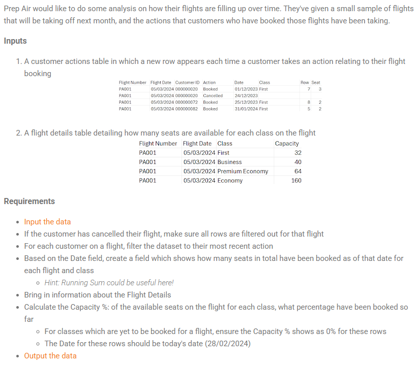

## 2024 Week 9 - Prep Air Capacity



```python
import pandas as pd
```


```python
df = pd.read_excel('PD 2024 Week 9 Input.xlsx', sheet_name=None)
df.keys()
```


    dict_keys(['Customer Actions', 'Flight Details'])


```python
customers_actions = df['Customer Actions']
flight_details = df['Flight Details']
```


```python
customers_actions.head()
```


<div>
<style scoped>
    .dataframe tbody tr th:only-of-type {
        vertical-align: middle;
    }

    .dataframe tbody tr th {
        vertical-align: top;
    }

    .dataframe thead th {
        text-align: right;
    }
</style>
<table border="1" class="dataframe">
  <thead>
    <tr style="text-align: right;">
      <th></th>
      <th>Flight Number</th>
      <th>Flight Date</th>
      <th>Customer ID</th>
      <th>Action</th>
      <th>Date</th>
      <th>Class</th>
      <th>Row</th>
      <th>Seat</th>
    </tr>
  </thead>
  <tbody>
    <tr>
      <th>0</th>
      <td>PA001</td>
      <td>2024-03-05</td>
      <td>20</td>
      <td>Booked</td>
      <td>2023-12-01</td>
      <td>First</td>
      <td>7.0</td>
      <td>3.0</td>
    </tr>
    <tr>
      <th>1</th>
      <td>PA001</td>
      <td>2024-03-05</td>
      <td>20</td>
      <td>Cancelled</td>
      <td>2023-12-24</td>
      <td>NaN</td>
      <td>NaN</td>
      <td>NaN</td>
    </tr>
    <tr>
      <th>2</th>
      <td>PA001</td>
      <td>2024-03-05</td>
      <td>72</td>
      <td>Booked</td>
      <td>2023-12-25</td>
      <td>First</td>
      <td>8.0</td>
      <td>2.0</td>
    </tr>
    <tr>
      <th>3</th>
      <td>PA001</td>
      <td>2024-03-05</td>
      <td>82</td>
      <td>Booked</td>
      <td>2024-01-31</td>
      <td>First</td>
      <td>5.0</td>
      <td>2.0</td>
    </tr>
    <tr>
      <th>4</th>
      <td>PA001</td>
      <td>2024-03-05</td>
      <td>190</td>
      <td>Booked</td>
      <td>2024-01-07</td>
      <td>Business</td>
      <td>12.0</td>
      <td>3.0</td>
    </tr>
  </tbody>
</table>
</div>


```python
flight_details.head()
```


<div>
<style scoped>
    .dataframe tbody tr th:only-of-type {
        vertical-align: middle;
    }

    .dataframe tbody tr th {
        vertical-align: top;
    }

    .dataframe thead th {
        text-align: right;
    }
</style>
<table border="1" class="dataframe">
  <thead>
    <tr style="text-align: right;">
      <th></th>
      <th>Flight Number</th>
      <th>Flight Date</th>
      <th>Class</th>
      <th>Capacity</th>
    </tr>
  </thead>
  <tbody>
    <tr>
      <th>0</th>
      <td>PA001</td>
      <td>2024-03-05</td>
      <td>First</td>
      <td>32</td>
    </tr>
    <tr>
      <th>1</th>
      <td>PA001</td>
      <td>2024-03-05</td>
      <td>Business</td>
      <td>40</td>
    </tr>
    <tr>
      <th>2</th>
      <td>PA001</td>
      <td>2024-03-05</td>
      <td>Premium Economy</td>
      <td>64</td>
    </tr>
    <tr>
      <th>3</th>
      <td>PA001</td>
      <td>2024-03-05</td>
      <td>Economy</td>
      <td>160</td>
    </tr>
    <tr>
      <th>4</th>
      <td>PA002</td>
      <td>2024-03-30</td>
      <td>First</td>
      <td>32</td>
    </tr>
  </tbody>
</table>
</div>


#### If the customer has cancelled their flight, make sure all rows are filtered out for that flight 


```python
cancelled_flights = customers_actions[customers_actions.Action == 'Cancelled']
cancelled_flights.head()
```


<div>
<style scoped>
    .dataframe tbody tr th:only-of-type {
        vertical-align: middle;
    }

    .dataframe tbody tr th {
        vertical-align: top;
    }

    .dataframe thead th {
        text-align: right;
    }
</style>
<table border="1" class="dataframe">
  <thead>
    <tr style="text-align: right;">
      <th></th>
      <th>Flight Number</th>
      <th>Flight Date</th>
      <th>Customer ID</th>
      <th>Action</th>
      <th>Date</th>
      <th>Class</th>
      <th>Row</th>
      <th>Seat</th>
    </tr>
  </thead>
  <tbody>
    <tr>
      <th>1</th>
      <td>PA001</td>
      <td>2024-03-05</td>
      <td>20</td>
      <td>Cancelled</td>
      <td>2023-12-24</td>
      <td>NaN</td>
      <td>NaN</td>
      <td>NaN</td>
    </tr>
    <tr>
      <th>11</th>
      <td>PA001</td>
      <td>2024-03-05</td>
      <td>253</td>
      <td>Cancelled</td>
      <td>2024-02-16</td>
      <td>NaN</td>
      <td>NaN</td>
      <td>NaN</td>
    </tr>
    <tr>
      <th>14</th>
      <td>PA001</td>
      <td>2024-03-05</td>
      <td>324</td>
      <td>Cancelled</td>
      <td>2023-12-22</td>
      <td>NaN</td>
      <td>NaN</td>
      <td>NaN</td>
    </tr>
    <tr>
      <th>16</th>
      <td>PA001</td>
      <td>2024-03-05</td>
      <td>326</td>
      <td>Cancelled</td>
      <td>2024-01-26</td>
      <td>NaN</td>
      <td>NaN</td>
      <td>NaN</td>
    </tr>
    <tr>
      <th>20</th>
      <td>PA001</td>
      <td>2024-03-05</td>
      <td>903</td>
      <td>Cancelled</td>
      <td>2024-01-04</td>
      <td>NaN</td>
      <td>NaN</td>
      <td>NaN</td>
    </tr>
  </tbody>
</table>
</div>


```python
uncancelled_customers = customers_actions.merge(right=cancelled_flights, 
                                                on=['Flight Number', 'Flight Date', 'Customer ID'], 
                                                how='outer', indicator=True)
uncancelled_customers = uncancelled_customers.query('_merge == "left_only"')
uncancelled_customers.drop(['Action_y', 'Date_y', 'Class_y', 'Row_y','Seat_y', '_merge'], axis=1, inplace=True)
uncancelled_customers.rename(columns=lambda x:x.replace('_x', ''), inplace=True)
uncancelled_customers.head()
```


<div>
<style scoped>
    .dataframe tbody tr th:only-of-type {
        vertical-align: middle;
    }

    .dataframe tbody tr th {
        vertical-align: top;
    }

    .dataframe thead th {
        text-align: right;
    }
</style>
<table border="1" class="dataframe">
  <thead>
    <tr style="text-align: right;">
      <th></th>
      <th>Flight Number</th>
      <th>Flight Date</th>
      <th>Customer ID</th>
      <th>Action</th>
      <th>Date</th>
      <th>Class</th>
      <th>Row</th>
      <th>Seat</th>
    </tr>
  </thead>
  <tbody>
    <tr>
      <th>2</th>
      <td>PA001</td>
      <td>2024-03-05</td>
      <td>72</td>
      <td>Booked</td>
      <td>2023-12-25</td>
      <td>First</td>
      <td>8.0</td>
      <td>2.0</td>
    </tr>
    <tr>
      <th>3</th>
      <td>PA001</td>
      <td>2024-03-05</td>
      <td>82</td>
      <td>Booked</td>
      <td>2024-01-31</td>
      <td>First</td>
      <td>5.0</td>
      <td>2.0</td>
    </tr>
    <tr>
      <th>4</th>
      <td>PA001</td>
      <td>2024-03-05</td>
      <td>190</td>
      <td>Booked</td>
      <td>2024-01-07</td>
      <td>Business</td>
      <td>12.0</td>
      <td>3.0</td>
    </tr>
    <tr>
      <th>5</th>
      <td>PA001</td>
      <td>2024-03-05</td>
      <td>190</td>
      <td>Upgraded</td>
      <td>2024-01-31</td>
      <td>First</td>
      <td>5.0</td>
      <td>3.0</td>
    </tr>
    <tr>
      <th>6</th>
      <td>PA001</td>
      <td>2024-03-05</td>
      <td>190</td>
      <td>Seat Changed</td>
      <td>2024-02-28</td>
      <td>First</td>
      <td>3.0</td>
      <td>4.0</td>
    </tr>
  </tbody>
</table>
</div>


```python
uncancelled_customers.info()
```

    <class 'pandas.core.frame.DataFrame'>
    Index: 1114 entries, 2 to 1698
    Data columns (total 8 columns):
     #   Column         Non-Null Count  Dtype         
    ---  ------         --------------  -----         
     0   Flight Number  1114 non-null   object        
     1   Flight Date    1114 non-null   datetime64[ns]
     2   Customer ID    1114 non-null   int64         
     3   Action         1114 non-null   object        
     4   Date           1114 non-null   datetime64[ns]
     5   Class          1114 non-null   object        
     6   Row            1114 non-null   float64       
     7   Seat           1114 non-null   float64       
    dtypes: datetime64[ns](2), float64(2), int64(1), object(3)
    memory usage: 78.3+ KB
    

#### For each customer on a flight, filter the dataset to their most recent action


```python
customers_recent = uncancelled_customers.groupby(['Flight Number', 'Customer ID'])['Date'].max().reset_index()
customers_recent = customers_recent.merge(right=uncancelled_customers, 
                                          on=['Flight Number', 'Customer ID', 'Date'], 
                                          how='inner')
customers_recent.info()
```

    <class 'pandas.core.frame.DataFrame'>
    RangeIndex: 491 entries, 0 to 490
    Data columns (total 8 columns):
     #   Column         Non-Null Count  Dtype         
    ---  ------         --------------  -----         
     0   Flight Number  491 non-null    object        
     1   Customer ID    491 non-null    int64         
     2   Date           491 non-null    datetime64[ns]
     3   Flight Date    491 non-null    datetime64[ns]
     4   Action         491 non-null    object        
     5   Class          491 non-null    object        
     6   Row            491 non-null    float64       
     7   Seat           491 non-null    float64       
    dtypes: datetime64[ns](2), float64(2), int64(1), object(3)
    memory usage: 30.8+ KB
    

#### Based on the Date field, create a field which shows how many seats in total have been booked as of that date for each flight and class
Hint: Running Sum could be useful here!


```python
customers_recent['Total Seats booked over time'] = 1
```


```python
customers_recent['Total Seats booked over time'] = customers_recent.groupby(['Flight Number', 
                                                                             'Class', 
                                                                             'Flight Date'])['Total Seats booked over time'].cumsum()

customers_recent.head()
```


<div>
<style scoped>
    .dataframe tbody tr th:only-of-type {
        vertical-align: middle;
    }

    .dataframe tbody tr th {
        vertical-align: top;
    }

    .dataframe thead th {
        text-align: right;
    }
</style>
<table border="1" class="dataframe">
  <thead>
    <tr style="text-align: right;">
      <th></th>
      <th>Flight Number</th>
      <th>Customer ID</th>
      <th>Date</th>
      <th>Flight Date</th>
      <th>Action</th>
      <th>Class</th>
      <th>Row</th>
      <th>Seat</th>
      <th>Total Seats booked over time</th>
    </tr>
  </thead>
  <tbody>
    <tr>
      <th>0</th>
      <td>PA001</td>
      <td>72</td>
      <td>2023-12-25</td>
      <td>2024-03-05</td>
      <td>Booked</td>
      <td>First</td>
      <td>8.0</td>
      <td>2.0</td>
      <td>1</td>
    </tr>
    <tr>
      <th>1</th>
      <td>PA001</td>
      <td>82</td>
      <td>2024-01-31</td>
      <td>2024-03-05</td>
      <td>Booked</td>
      <td>First</td>
      <td>5.0</td>
      <td>2.0</td>
      <td>2</td>
    </tr>
    <tr>
      <th>2</th>
      <td>PA001</td>
      <td>190</td>
      <td>2024-02-28</td>
      <td>2024-03-05</td>
      <td>Seat Changed</td>
      <td>First</td>
      <td>3.0</td>
      <td>4.0</td>
      <td>3</td>
    </tr>
    <tr>
      <th>3</th>
      <td>PA001</td>
      <td>228</td>
      <td>2024-01-02</td>
      <td>2024-03-05</td>
      <td>Upgraded</td>
      <td>First</td>
      <td>7.0</td>
      <td>2.0</td>
      <td>4</td>
    </tr>
    <tr>
      <th>4</th>
      <td>PA001</td>
      <td>330</td>
      <td>2024-02-13</td>
      <td>2024-03-05</td>
      <td>Seat Changed</td>
      <td>Business</td>
      <td>9.0</td>
      <td>1.0</td>
      <td>1</td>
    </tr>
  </tbody>
</table>
</div>


#### Bring in information about the Flight Details


```python
customers_recent = customers_recent.merge(right=flight_details, on=['Flight Number', 'Class', 'Flight Date'], how='left')
customers_recent.head()
```


<div>
<style scoped>
    .dataframe tbody tr th:only-of-type {
        vertical-align: middle;
    }

    .dataframe tbody tr th {
        vertical-align: top;
    }

    .dataframe thead th {
        text-align: right;
    }
</style>
<table border="1" class="dataframe">
  <thead>
    <tr style="text-align: right;">
      <th></th>
      <th>Flight Number</th>
      <th>Customer ID</th>
      <th>Date</th>
      <th>Flight Date</th>
      <th>Action</th>
      <th>Class</th>
      <th>Row</th>
      <th>Seat</th>
      <th>Total Seats booked over time</th>
      <th>Capacity</th>
    </tr>
  </thead>
  <tbody>
    <tr>
      <th>0</th>
      <td>PA001</td>
      <td>72</td>
      <td>2023-12-25</td>
      <td>2024-03-05</td>
      <td>Booked</td>
      <td>First</td>
      <td>8.0</td>
      <td>2.0</td>
      <td>1</td>
      <td>32</td>
    </tr>
    <tr>
      <th>1</th>
      <td>PA001</td>
      <td>82</td>
      <td>2024-01-31</td>
      <td>2024-03-05</td>
      <td>Booked</td>
      <td>First</td>
      <td>5.0</td>
      <td>2.0</td>
      <td>2</td>
      <td>32</td>
    </tr>
    <tr>
      <th>2</th>
      <td>PA001</td>
      <td>190</td>
      <td>2024-02-28</td>
      <td>2024-03-05</td>
      <td>Seat Changed</td>
      <td>First</td>
      <td>3.0</td>
      <td>4.0</td>
      <td>3</td>
      <td>32</td>
    </tr>
    <tr>
      <th>3</th>
      <td>PA001</td>
      <td>228</td>
      <td>2024-01-02</td>
      <td>2024-03-05</td>
      <td>Upgraded</td>
      <td>First</td>
      <td>7.0</td>
      <td>2.0</td>
      <td>4</td>
      <td>32</td>
    </tr>
    <tr>
      <th>4</th>
      <td>PA001</td>
      <td>330</td>
      <td>2024-02-13</td>
      <td>2024-03-05</td>
      <td>Seat Changed</td>
      <td>Business</td>
      <td>9.0</td>
      <td>1.0</td>
      <td>1</td>
      <td>40</td>
    </tr>
  </tbody>
</table>
</div>


#### Calculate the Capacity %: of the available seats on the flight for each class, what percentage have been booked so far
- For classes which are yet to be booked for a flight, ensure the Capacity % shows as 0% for these rows
- The Date for these rows should be today's date (28/02/2024) 


```python
customers_recent['Capacity %'] = customers_recent['Total Seats booked over time'] / customers_recent.Capacity
```


```python
customers_recent.head()
```


<div>
<style scoped>
    .dataframe tbody tr th:only-of-type {
        vertical-align: middle;
    }

    .dataframe tbody tr th {
        vertical-align: top;
    }

    .dataframe thead th {
        text-align: right;
    }
</style>
<table border="1" class="dataframe">
  <thead>
    <tr style="text-align: right;">
      <th></th>
      <th>Flight Number</th>
      <th>Customer ID</th>
      <th>Date</th>
      <th>Flight Date</th>
      <th>Action</th>
      <th>Class</th>
      <th>Row</th>
      <th>Seat</th>
      <th>Total Seats booked over time</th>
      <th>Capacity</th>
      <th>Capacity %</th>
    </tr>
  </thead>
  <tbody>
    <tr>
      <th>0</th>
      <td>PA001</td>
      <td>72</td>
      <td>2023-12-25</td>
      <td>2024-03-05</td>
      <td>Booked</td>
      <td>First</td>
      <td>8.0</td>
      <td>2.0</td>
      <td>1</td>
      <td>32</td>
      <td>0.03125</td>
    </tr>
    <tr>
      <th>1</th>
      <td>PA001</td>
      <td>82</td>
      <td>2024-01-31</td>
      <td>2024-03-05</td>
      <td>Booked</td>
      <td>First</td>
      <td>5.0</td>
      <td>2.0</td>
      <td>2</td>
      <td>32</td>
      <td>0.06250</td>
    </tr>
    <tr>
      <th>2</th>
      <td>PA001</td>
      <td>190</td>
      <td>2024-02-28</td>
      <td>2024-03-05</td>
      <td>Seat Changed</td>
      <td>First</td>
      <td>3.0</td>
      <td>4.0</td>
      <td>3</td>
      <td>32</td>
      <td>0.09375</td>
    </tr>
    <tr>
      <th>3</th>
      <td>PA001</td>
      <td>228</td>
      <td>2024-01-02</td>
      <td>2024-03-05</td>
      <td>Upgraded</td>
      <td>First</td>
      <td>7.0</td>
      <td>2.0</td>
      <td>4</td>
      <td>32</td>
      <td>0.12500</td>
    </tr>
    <tr>
      <th>4</th>
      <td>PA001</td>
      <td>330</td>
      <td>2024-02-13</td>
      <td>2024-03-05</td>
      <td>Seat Changed</td>
      <td>Business</td>
      <td>9.0</td>
      <td>1.0</td>
      <td>1</td>
      <td>40</td>
      <td>0.02500</td>
    </tr>
  </tbody>
</table>
</div>


